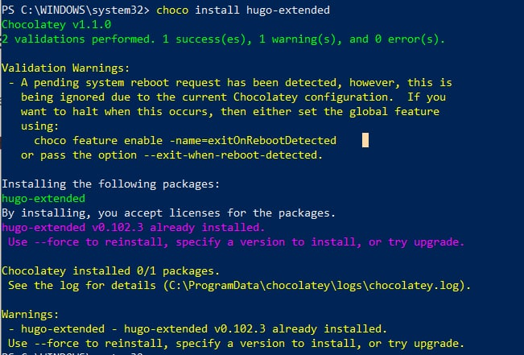
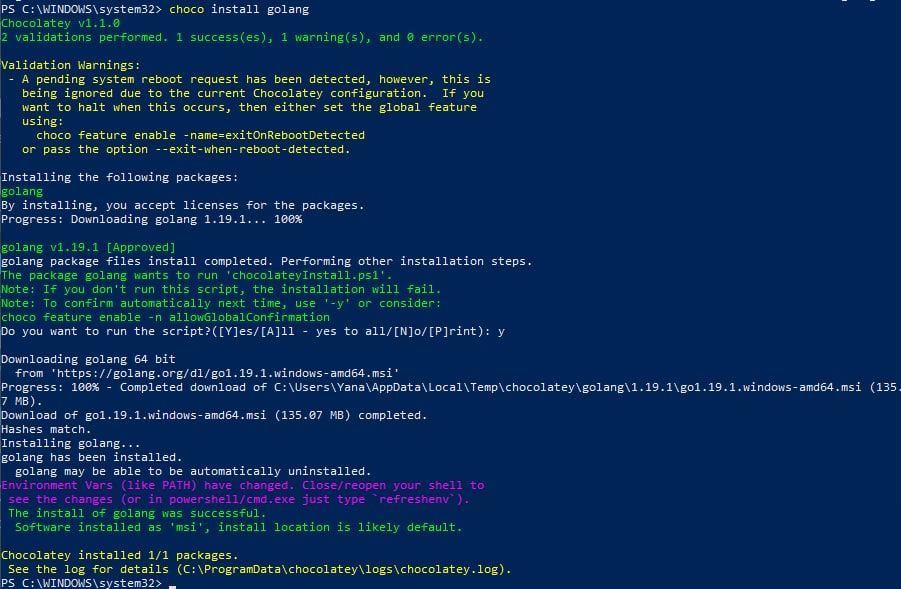
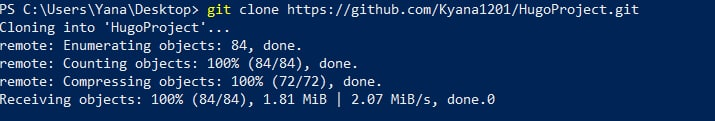
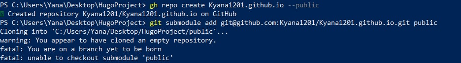
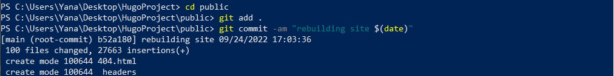
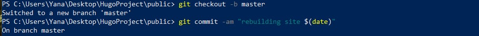
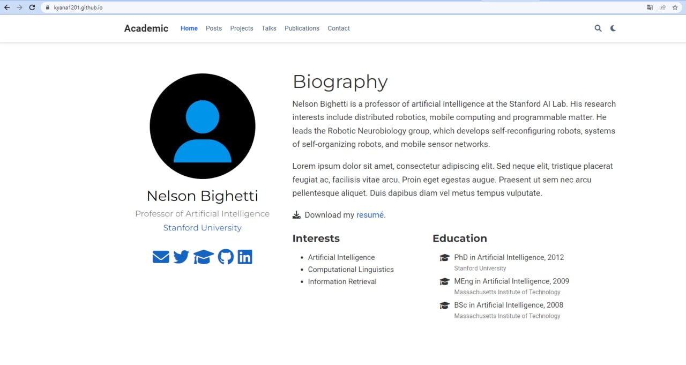

---
## Front matter
lang: ru-RU
title: Презентация по выполнению 1 этапа индивидуального проекта
author:
  - Хохлачева Яна Дмитриевна, НПМмд-02-22
institute:
  - Российский университет дружбы народов, Москва, Россия
date: 24 сентября 2022

## i18n babel
babel-lang: russian
babel-otherlangs: english

## Formatting pdf
toc: false
toc-title: Содержание
slide_level: 2
aspectratio: 169
section-titles: true
theme: metropolis
header-includes:
 - \metroset{progressbar=frametitle,sectionpage=progressbar,numbering=fraction}
 - '\makeatletter'
 - '\beamer@ignorenonframefalse'
 - '\makeatother'
---

# Цели и задачи

## Цель лабораторной работы

 Размещение на Github pages заготовки для персонального сайта.

## Задачи лабораторной работы 

1. Установить необходимое программное обеспечение.
2. Скачать шаблон темы сайта.
3. Разместить его на хостинге git.
4. Установить параметр для URLs сайта.
5. Разместить заготовку сайта на Github pages.

# Выполнение лабораторной работы

## Необходимое программное обеспечение

{ #fig:001 width=70% }

{ #fig:002 width=70% }

## Шаблон темы сайта

{ #fig:003 width=70% }

## Разместить его на хостинге git и подключение репозитория к вложенной папке

{ #fig:004 width=70% }

## Генерация и развёртывание сайта

{ #fig:005 width=70% }

{ #fig:006 width=70% }

## Результат

{ #fig:007 width=70% }

# Выводы

## Результаты выполнения лабораторной работы

Таким образом в процессе первого этапа индивидуального проекта я установила hugo и golang и, используя шаблон темы сайта, разместила на Github pages заготовки для персонального сайта.

