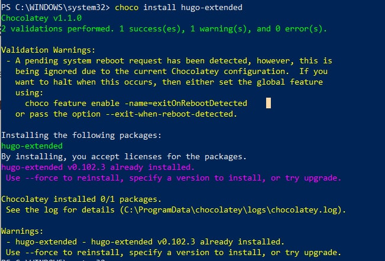
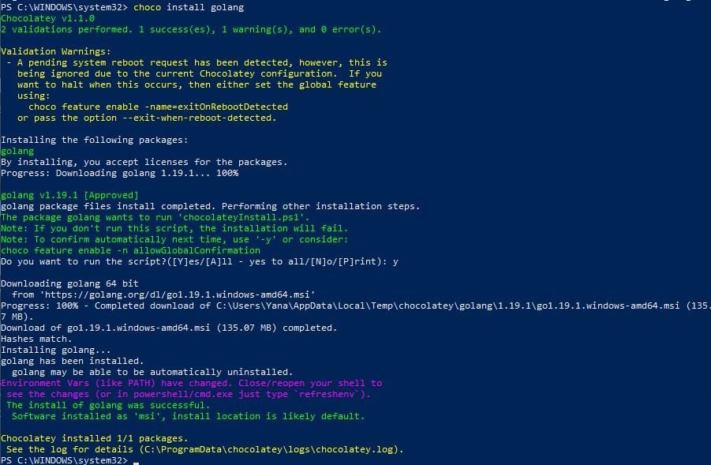
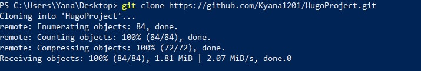
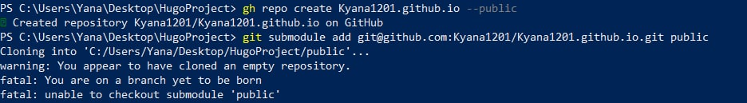
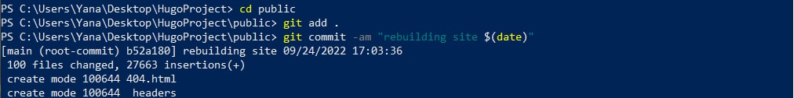
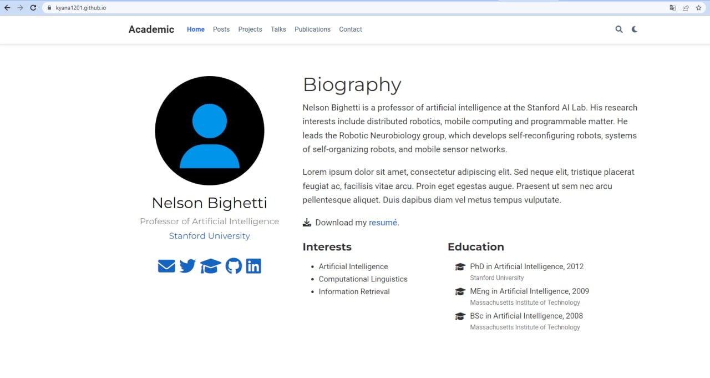

---
## Front matter
title: "Отчет по выполнению 1 этапа индивидуального проекта"

author: "Хохлачева Яна Дмитриевна, НПМмд-02-22"

## Generic otions
lang: ru-RU
toc-title: "Содержание"

## Bibliography
bibliography: bib/cite.bib
csl: pandoc/csl/gost-r-7-0-5-2008-numeric.csl

## Pdf output format
toc: true # Table of contents
toc-depth: 2
lof: true # List of figures
lot: true # List of tables
fontsize: 12pt
linestretch: 1.5
papersize: a4
documentclass: scrreprt
## I18n polyglossia
polyglossia-lang:
  name: russian
  options:
	- spelling=modern
	- babelshorthands=true
polyglossia-otherlangs:
  name: english
## I18n babel
babel-lang: russian
babel-otherlangs: english
## Fonts
mainfont: PT Serif
romanfont: PT Serif
sansfont: PT Sans
monofont: PT Mono
mainfontoptions: Ligatures=TeX
romanfontoptions: Ligatures=TeX
sansfontoptions: Ligatures=TeX,Scale=MatchLowercase
monofontoptions: Scale=MatchLowercase,Scale=0.9
## Biblatex
biblatex: true
biblio-style: "gost-numeric"
biblatexoptions:
  - parentracker=true
  - backend=biber
  - hyperref=auto
  - language=auto
  - autolang=other*
  - citestyle=gost-numeric
## Pandoc-crossref LaTeX customization
figureTitle: "Рис."
tableTitle: "Таблица"
listingTitle: "Листинг"
lofTitle: "Список иллюстраций"
lotTitle: "Список таблиц"
lolTitle: "Листинги"
## Misc options
indent: true
header-includes:
  - \usepackage{indentfirst}
  - \usepackage{float} # keep figures where there are in the text
  - \floatplacement{figure}{H} # keep figures where there are in the text
---

# Цель работы

Размещение на Github pages заготовки для персонального сайта.

# Задание

1. Установить необходимое программное обеспечение.
2. Скачать шаблон темы сайта.
3. Разместить его на хостинге git.
4. Установить параметр для URLs сайта.
5. Разместить заготовку сайта на Github pages.

# Выполнение лабораторной работы

## Необходимое программное обеспечение

Установила hugo с помощью команды, представленной на Рисунке 1 (рис. [-@fig:001]), и Golang (рис. [-@fig:002]).

{ #fig:001 width=70% }

{ #fig:002 width=70% }

## Шаблон темы сайта

 - В качестве шаблона индивидуального сайта использовала шаблон Hugo Academic Theme.(рис. [-@fig:003])

{ #fig:003 width=70% }

 - Изменила baseURL в config.yaml baseURL: 'https://Kyana1201.github.io' # Website URL
 - Удалила `content\home\demo`

## Разместить его на хостинге git и подключение репозитория к вложенной папке

 - Создала репозиторий для страницы пользователя на Github, а также создала подмодуль public в папке блога(рис. [-@fig:004])

{ #fig:004 width=70% }

## Генерация и развёртывание сайта

- Сгенерировала проект с помощью команды hugo
- Зафиксировала изменения(рис. [-@fig:005])
- Отправила контент на GitHub(рис. [-@fig:006])

{ #fig:005 width=70% }

{ #fig:006 width=70% }

## Результат

 - Сгенерированный сайт https://kyana1201.github.io/

{ #fig:007 width=70% }

# Выводы

Таким образом в процессе первого этапа индивидуального проекта я установила hugo и golang и, используя шаблон темы сайта, разместила на Github pages заготовки для персонального сайта.

# Список литературы{.unnumbered}

::: {#refs}
:::
