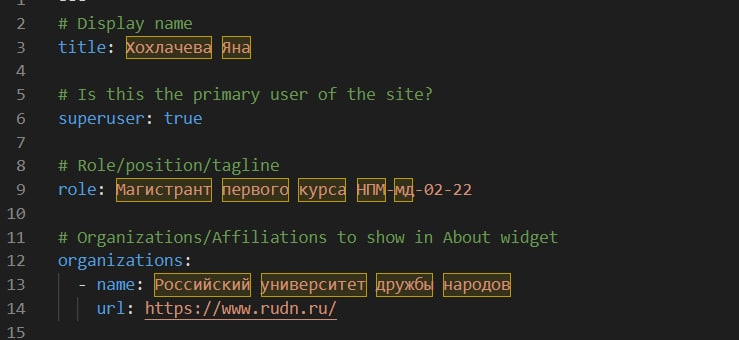

---
## Front matter
lang: ru-RU
title: Презентация по выполнению 2 этапа индивидуального проекта
author:
  - Хохлачева Яна Дмитриевна, НПМмд-02-22
institute:
  - Российский университет дружбы народов, Москва, Россия
date: 10 октября 2022

## i18n babel
babel-lang: russian
babel-otherlangs: english

## Formatting pdf
toc: false
toc-title: Содержание
slide_level: 2
aspectratio: 169
section-titles: true
theme: metropolis
header-includes:
 - \metroset{progressbar=frametitle,sectionpage=progressbar,numbering=fraction}
 - '\makeatletter'
 - '\beamer@ignorenonframefalse'
 - '\makeatother'
---

# Цели и задачи

## Цель этапа индивидуального проекта

Добавление к сайту данных о себе.

## Задачи этапа индивидуального проекта 

* Разместить фотографию владельца сайта.
* Разместить краткое описание владельца сайта (Biography).
* Добавить информацию об интересах (Interests).
* Добавить информацию об образовании (Education).
* Добавить пост на тему по выбору: Управление версиями. Git.

# Выполнение этапа индивидуального проекта

## Размещение фотографии владельца сайта

{ #fig:001 width=70% }

## Размещение краткого описания владельца сайта (Biography).

{ #fig:002 width=70% }

{ #fig:003 width=70% }

## Добавление информации об интересах (Interests) и об образовании (Education).

{ #fig:004 width=70% }

## Добавить пост на тему "Управление версиями. Git."

{ #fig:006 width=70% }

{ #fig:007 width=70% }

{ #fig:008 width=70% }

## Результат

{ #fig:005 width=70% }

# Выводы

## Результаты выполнения этапа индивидуального проекта

Таким образом в процессе второго этапа индивидуального проекта я добавила основную информацию о себе, а также добавила пост на сайт.

