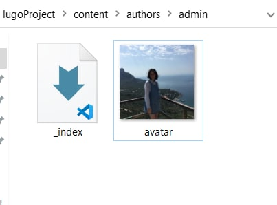
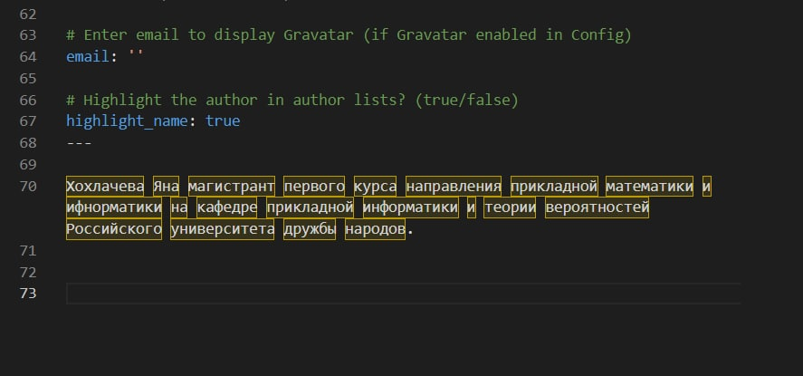
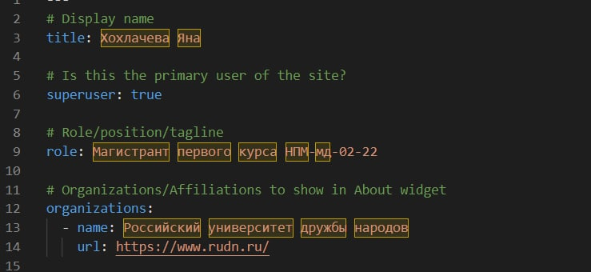
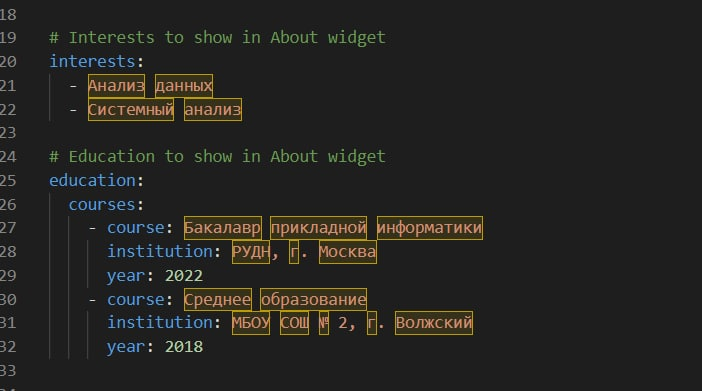
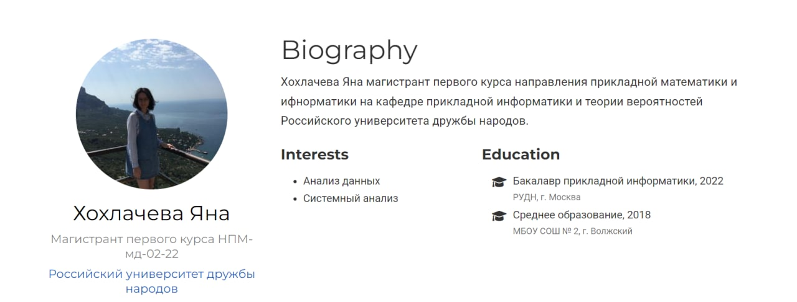
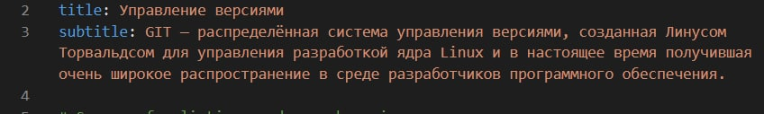
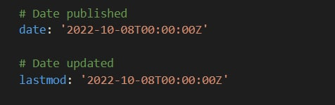
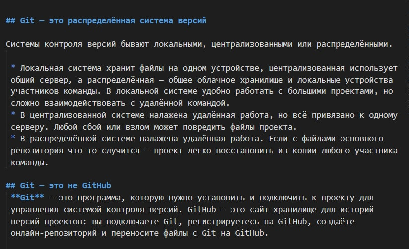

---
## Front matter
title: "Отчет по выполнению 2 этапа индивидуального проекта"

author: "Хохлачева Яна Дмитриевна, НПМмд-02-22"

## Generic otions
lang: ru-RU
toc-title: "Содержание"

## Bibliography
bibliography: bib/cite.bib
csl: pandoc/csl/gost-r-7-0-5-2008-numeric.csl

## Pdf output format
toc: true # Table of contents
toc-depth: 2
lof: true # List of figures
lot: true # List of tables
fontsize: 12pt
linestretch: 1.5
papersize: a4
documentclass: scrreprt
## I18n polyglossia
polyglossia-lang:
  name: russian
  options:
	- spelling=modern
	- babelshorthands=true
polyglossia-otherlangs:
  name: english
## I18n babel
babel-lang: russian
babel-otherlangs: english
## Fonts
mainfont: PT Serif
romanfont: PT Serif
sansfont: PT Sans
monofont: PT Mono
mainfontoptions: Ligatures=TeX
romanfontoptions: Ligatures=TeX
sansfontoptions: Ligatures=TeX,Scale=MatchLowercase
monofontoptions: Scale=MatchLowercase,Scale=0.9
## Biblatex
biblatex: true
biblio-style: "gost-numeric"
biblatexoptions:
  - parentracker=true
  - backend=biber
  - hyperref=auto
  - language=auto
  - autolang=other*
  - citestyle=gost-numeric
## Pandoc-crossref LaTeX customization
figureTitle: "Рис."
tableTitle: "Таблица"
listingTitle: "Листинг"
lofTitle: "Список иллюстраций"
lotTitle: "Список таблиц"
lolTitle: "Листинги"
## Misc options
indent: true
header-includes:
  - \usepackage{indentfirst}
  - \usepackage{float} # keep figures where there are in the text
  - \floatplacement{figure}{H} # keep figures where there are in the text
---

# Цель работы

Добавление к сайту данных о себе.

# Задание

## Список добавляемых данных.

* Разместить фотографию владельца сайта.
* Разместить краткое описание владельца сайта (Biography).
* Добавить информацию об интересах (Interests).
* Добавить информацию об образовании (Education).

## Добавить пост на тему по выбору:
* Управление версиями. Git.

# Выполнение лабораторной работы

## Размещение фотографии владельца сайта

В папке "HugoProject/content/authors/admin" замеменила фотографию шаблона на свою (рис. [-@fig:001]).

{ #fig:001 width=70% }

## Размещение краткого описания владельца сайта (Biography).

В файле index папки "HugoProject/content/authors/admin" изменила информацию соответствующую своим данным (рис. [-@fig:002] и [-@fig:003])

{ #fig:002 width=70% }

{ #fig:003 width=70% }

## Добавление информации об интересах (Interests) и об образовании (Education).

 В файле index папки "HugoProject/content/authors/admin" также изменила информацию соответствующую своим данным по интересам и образованию (рис. [-@fig:004]). На рисунке [-@fig:005] представлен получивший результат

{ #fig:004 width=70% }

{ #fig:005 width=70% }

## Добавить пост на тему "Управление версиями. Git."

 - В папке "HugoProject/content/post" создала дополнительную папку с контентом version-control-git. В файле index изменила информаицю: заголовок, дата публикаации, а также основной текст.(рис. [-@fig:006], [-@fig:007], [-@fig:008])

{ #fig:006 width=70% }

{ #fig:007 width=70% }

{ #fig:008 width=70% }

# Выводы

Таким образом в процессе второго этапа индивидуального проекта я добавила основную информацию о себе, а также добавила пост на сайт.

# Список литературы{.unnumbered}

::: {#refs}
:::
