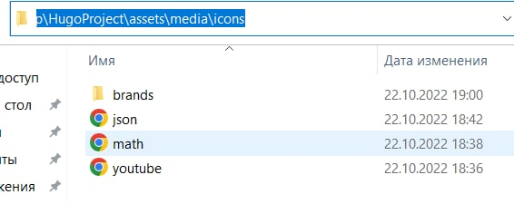
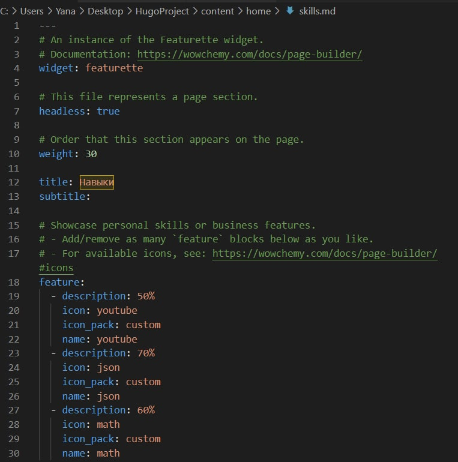
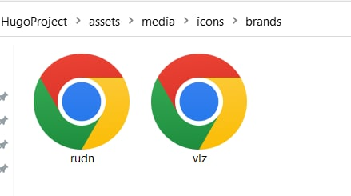
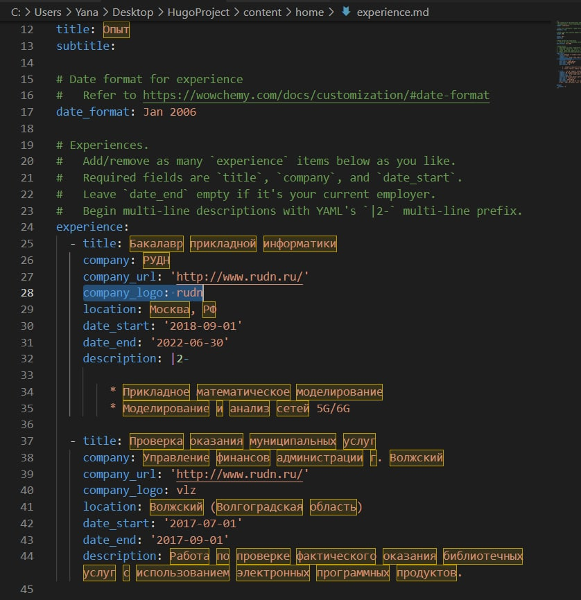
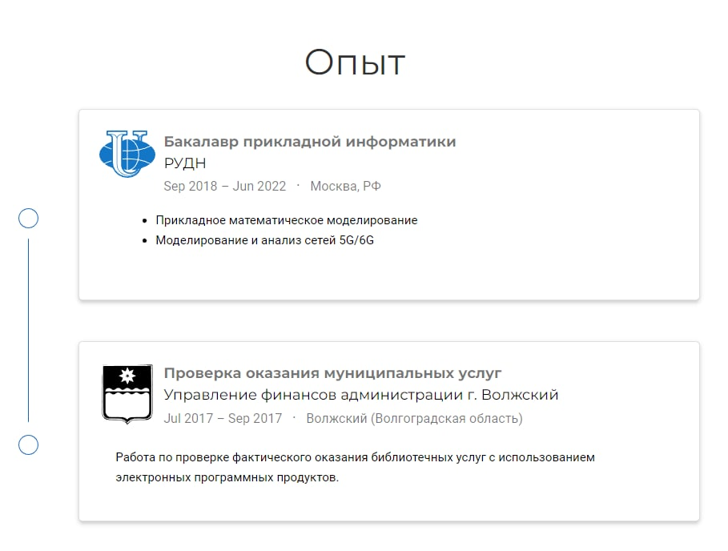
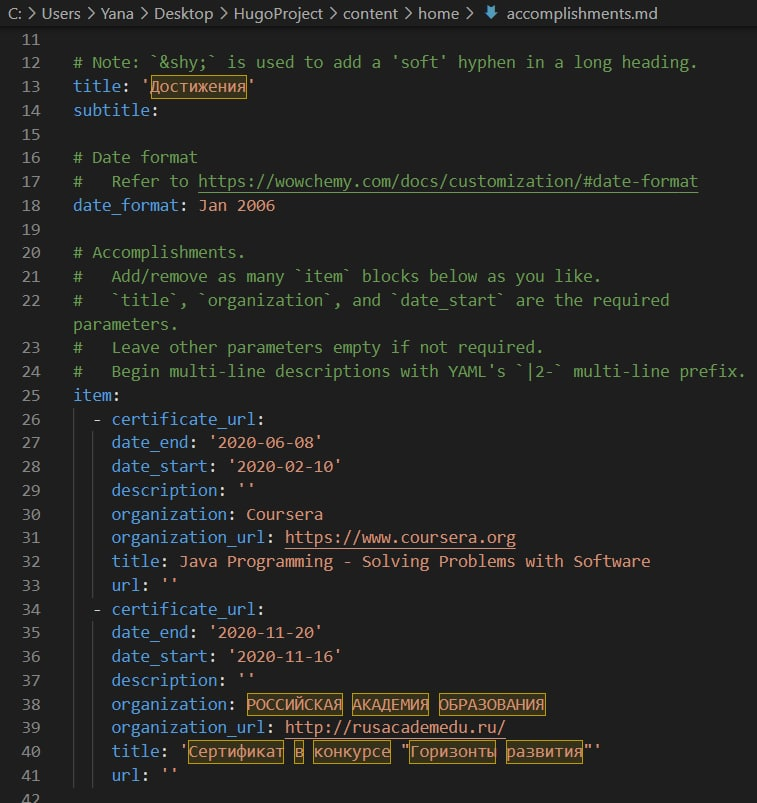
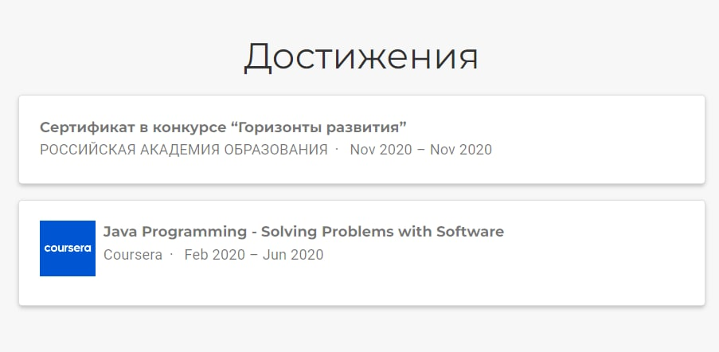
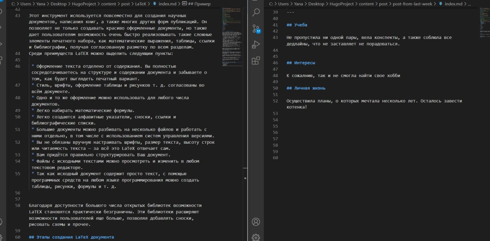
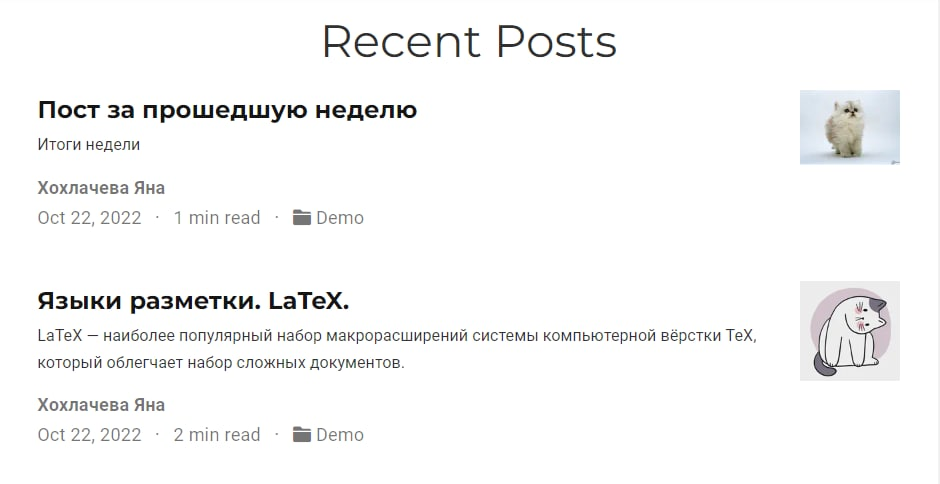

---
## Front matter
lang: ru-RU
title: Презентация по выполнению 3 этапа индивидуального проекта
author:
  - Хохлачева Яна Дмитриевна, НПМмд-02-22
institute:
  - Российский университет дружбы народов, Москва, Россия
date: 22 октября 2022

## i18n babel
babel-lang: russian
babel-otherlangs: english

## Formatting pdf
toc: false
toc-title: Содержание
slide_level: 2
aspectratio: 169
section-titles: true
theme: metropolis
header-includes:
 - \metroset{progressbar=frametitle,sectionpage=progressbar,numbering=fraction}
 - '\makeatletter'
 - '\beamer@ignorenonframefalse'
 - '\makeatother'
---

# Цели и задачи

## Цель этапа индивидуального проекта

Добавить к сайту достижения

## Задачи этапа индивидуального проекта 

* Добавить информацию о навыках (Skills)
* Добавить информацию об опыте (Experience)
* Добавить информацию о достижениях (Accomplishments)
* Пост по прошедшей неделе
* Языки разметки. LaTeX

# Выполнение этапа индивидуального проекта

## Добавление информации о навыках (Skills)

{ #fig:001 width=70% }

## Добавление информации о навыках (Skills)

{ #fig:002 width=70% }

## Добавление информации об опыте (Experience)

{ #fig:003 width=70% }

## Добавление информации об опыте (Experience)

{ #fig:004 width=70% }

## Добавление информации об опыте (Experience)

{ #fig:005 width=70% }

## Добавление информации о достижениях (Accomplishments)

{ #fig:006 width=70% }

## Добавление информации о достижениях (Accomplishments)

{ #fig:007 width=70% }

## Добавление постов на тему "Языки разметки. LaTeX" и "Пост за прошедшую неделю"

{ #fig:008 width=70% }

## Добавление постов на тему "Языки разметки. LaTeX" и "Пост за прошедшую неделю"

{ #fig:009 width=70% }

## Добавление постов на тему "Языки разметки. LaTeX" и "Пост за прошедшую неделю"

{ #fig:010 width=70% }

# Выводы

## Результаты выполнения этапа индивидуального проекта

Таким образом в процессе третьего этапа индивидуального проекта я добавила основную информацию о себе, а также добавила пост на сайт.
