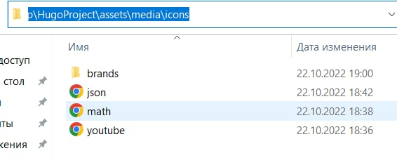
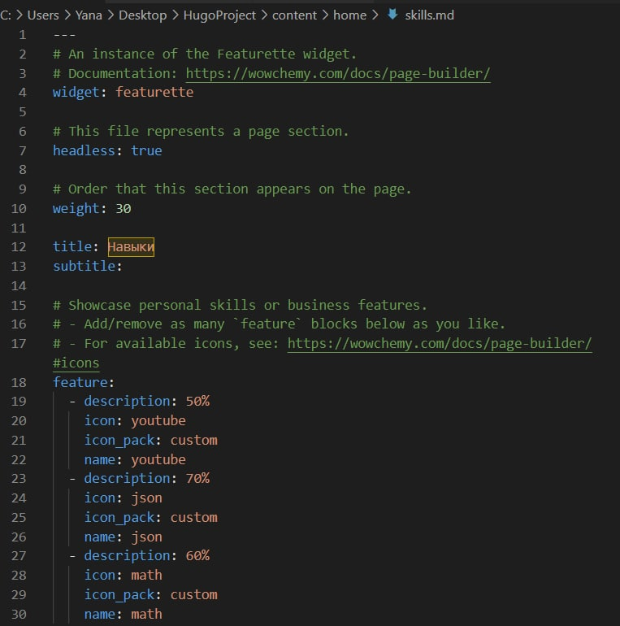
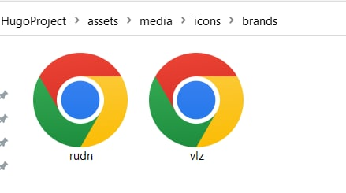
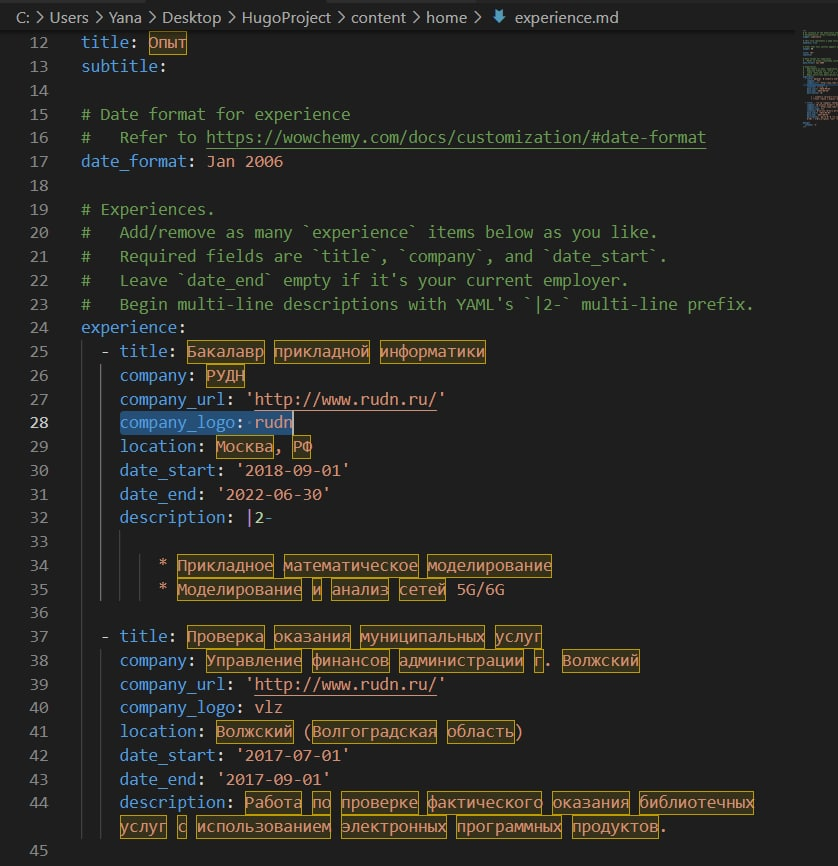
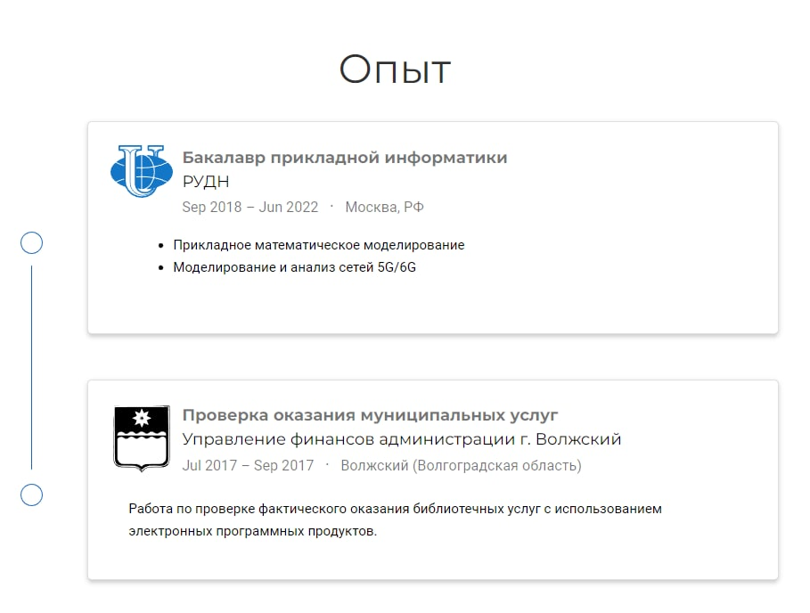
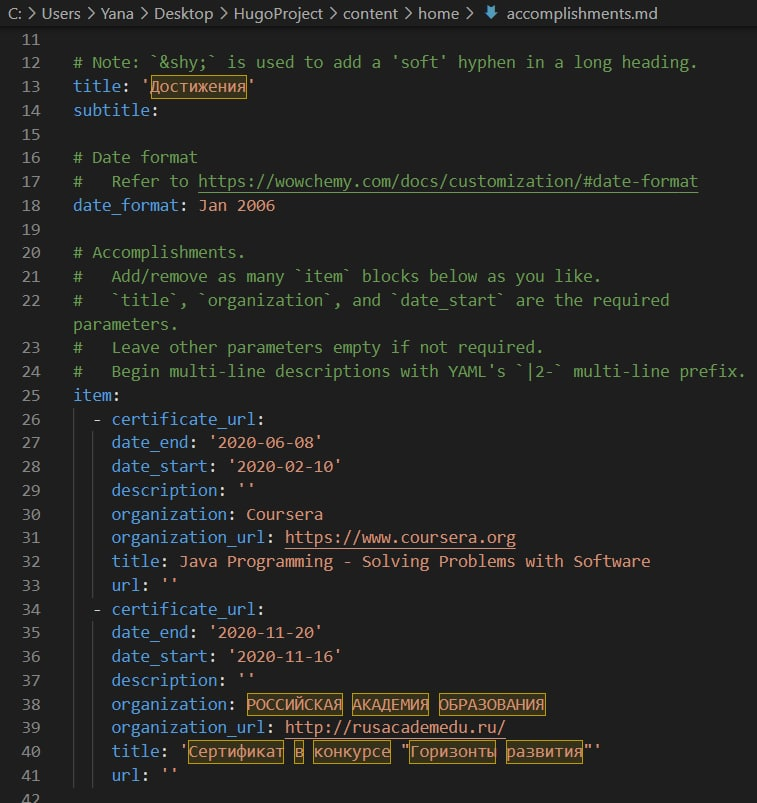
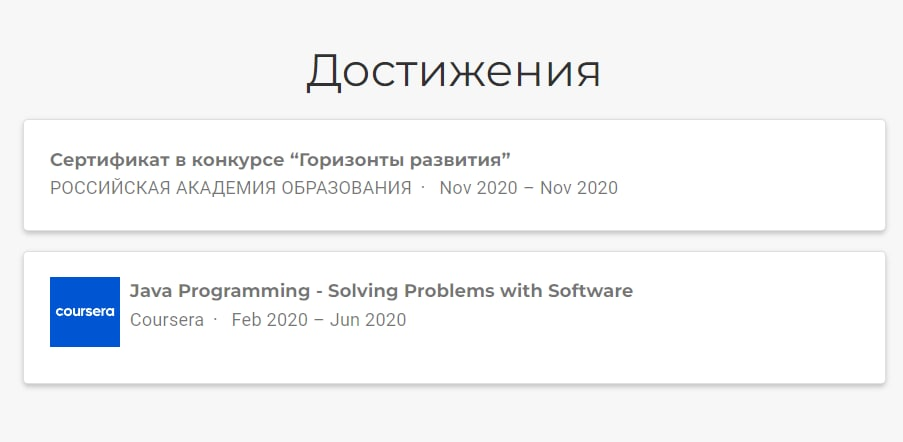
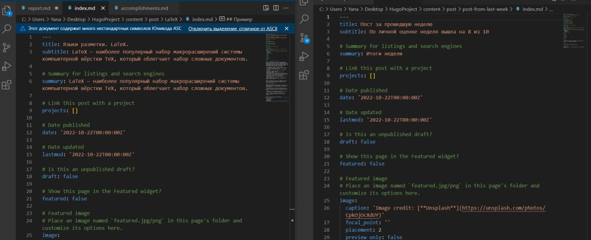
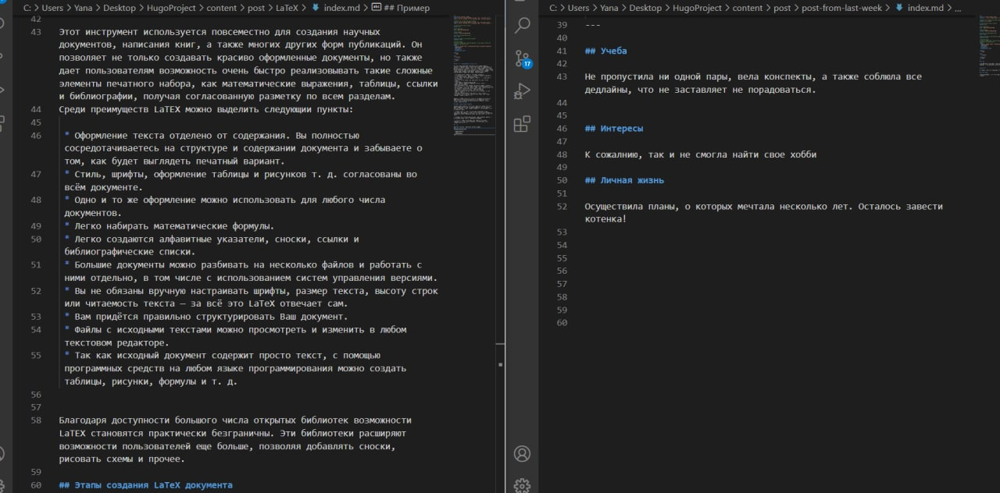
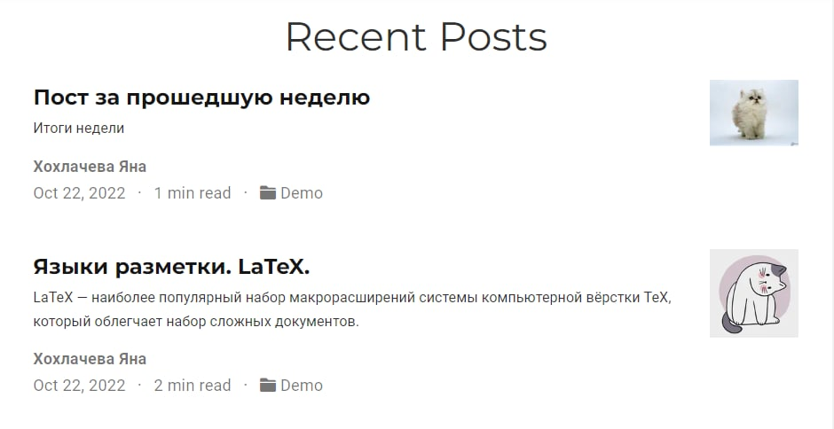

---
## Front matter
title: "Отчет по выполнению 3 этапа индивидуального проекта"

author: "Хохлачева Яна Дмитриевна, НПМмд-02-22"

## Generic otions
lang: ru-RU
toc-title: "Содержание"

## Bibliography
bibliography: bib/cite.bib
csl: pandoc/csl/gost-r-7-0-5-2008-numeric.csl

## Pdf output format
toc: true # Table of contents
toc-depth: 2
lof: true # List of figures
lot: true # List of tables
fontsize: 12pt
linestretch: 1.5
papersize: a4
documentclass: scrreprt
## I18n polyglossia
polyglossia-lang:
  name: russian
  options:
	- spelling=modern
	- babelshorthands=true
polyglossia-otherlangs:
  name: english
## I18n babel
babel-lang: russian
babel-otherlangs: english
## Fonts
mainfont: PT Serif
romanfont: PT Serif
sansfont: PT Sans
monofont: PT Mono
mainfontoptions: Ligatures=TeX
romanfontoptions: Ligatures=TeX
sansfontoptions: Ligatures=TeX,Scale=MatchLowercase
monofontoptions: Scale=MatchLowercase,Scale=0.9
## Biblatex
biblatex: true
biblio-style: "gost-numeric"
biblatexoptions:
  - parentracker=true
  - backend=biber
  - hyperref=auto
  - language=auto
  - autolang=other*
  - citestyle=gost-numeric
## Pandoc-crossref LaTeX customization
figureTitle: "Рис."
tableTitle: "Таблица"
listingTitle: "Листинг"
lofTitle: "Список иллюстраций"
lotTitle: "Список таблиц"
lolTitle: "Листинги"
## Misc options
indent: true
header-includes:
  - \usepackage{indentfirst}
  - \usepackage{float} # keep figures where there are in the text
  - \floatplacement{figure}{H} # keep figures where there are in the text
---

# Цель работы

Добавить к сайту достижения.

# Задание

## Список достижений.

* Добавить информацию о навыках (Skills)
* Добавить информацию об опыте (Experience)
* Добавить информацию о достижениях (Accomplishments)

## Добавить пост:
* Пост по прошедшей неделе
* Языки разметки. LaTeX

# Выполнение индивидуального проекта

## Добавление информации о навыках (Skills)

В папке "HugoProject/assets/media/icons" добавила иконки (рис. [-@fig:001]).

{ #fig:001 width=70% }

В файле skills папки "HugoProject/content/home" изменила информацию соответствующую своим данным (рис. [-@fig:002])

{ #fig:002 width=70% }

## Добавление информации об опыте (Experience)

В папке "HugoProject/assets/media/icons/brands" добавила иконки (рис. [-@fig:003]).

{ #fig:003 width=70% }

 В файле Experience папки "HugoProject/content/home" также изменила информацию соответствующую своим данным опыта (рис. [-@fig:004]). На рисунке [-@fig:005] представлен получивший результат

{ #fig:004 width=70% }

{ #fig:005 width=70% }

## Добавление информации о достижениях (Accomplishments)

 В файле accomplishments папки "HugoProject/content/home" также изменила информацию соответствующую своим данным опыта (рис. [-@fig:006]). На рисунке [-@fig:007] представлен получивший результат

{ #fig:006 width=70% }

{ #fig:007 width=70% }

## Добавление постов на тему "Языки разметки. LaTeX" и "Пост за прошедшую неделю"

 - В папке "HugoProject/content/post" создала дополнительные папки с контентом LaTeX и post-from-last-week. В файле index изменила информаицю: заголовок, дата публикаации, а также основной текст.(рис. [-@fig:008], [-@fig:009], [-@fig:010])

{ #fig:008 width=70% }

{ #fig:009 width=70% }

{ #fig:010 width=70% }

# Выводы

Таким образом в процессе третьего этапа индивидуального проекта я добавила основную информацию о себе, а также добавила пост на сайт.

# Список литературы{.unnumbered}

::: {#refs}
:::
