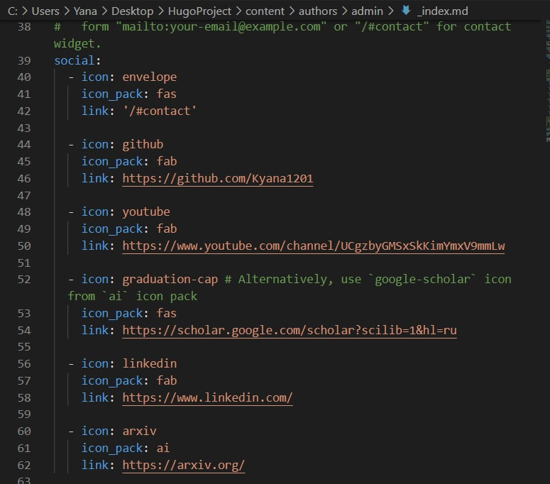
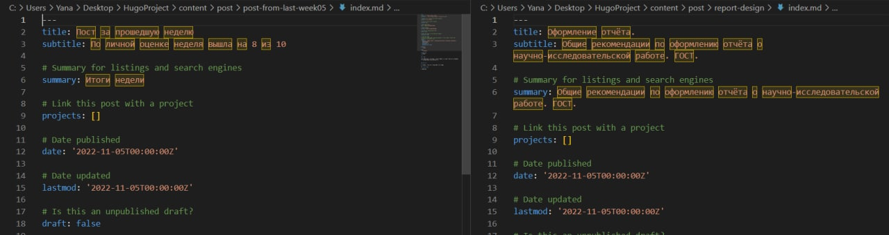
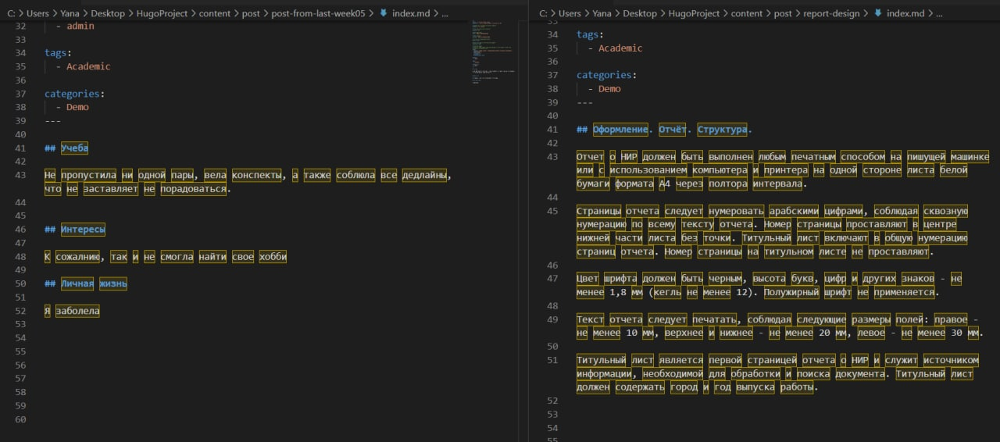
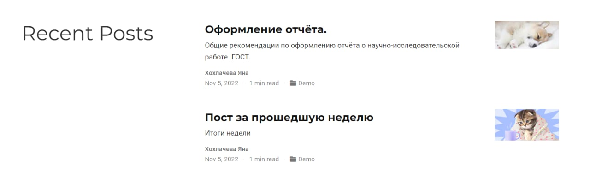

---
## Front matter
lang: ru-RU
title: Презентация по выполнению 4 этапа индивидуального проекта
author:
  - Хохлачева Яна Дмитриевна, НПМмд-02-22
institute:
  - Российский университет дружбы народов, Москва, Россия
date: 05 ноября 2022

## i18n babel
babel-lang: russian
babel-otherlangs: english

## Formatting pdf
toc: false
toc-title: Содержание
slide_level: 2
aspectratio: 169
section-titles: true
theme: metropolis
header-includes:
 - \metroset{progressbar=frametitle,sectionpage=progressbar,numbering=fraction}
 - '\makeatletter'
 - '\beamer@ignorenonframefalse'
 - '\makeatother'
---

# Цели и задачи

## Цель этапа индивидуального проекта

Добавить к сайту ссылки на научные и библиометрические ресурсы.

## Задачи этапа индивидуального проекта 

Добавить к сайту ссылки на научные и библиометрические ресурсы

* eLibrary : https://elibrary.ru/;
* Google Scholar : https://scholar.google.com/;
* ORCID : https://orcid.org/;
* Mendeley : https://www.mendeley.com/;
* ResearchGate : https://www.researchgate.net/;
* Academia.edu : https://www.academia.edu/;
* arXiv : https://arxiv.org/;
* github : https://github.com/.

## Задачи этапа индивидуального проекта 

Добавить пост:

* Оформление отчёта
* За прошедшую неделю

# Выполнение этапа индивидуального проекта

## Добавление ссылок на научные и библиометрические ресурсы(social)

{ #fig:001 width=70% }

## Добавление постов на тему "Оформление отчёта" и "Пост за прошедшую неделю"

{ #fig:002 width=70% }

## Добавление постов на тему "Оформление отчёта" и "Пост за прошедшую неделю"

{ #fig:003 width=70% }

## Добавление постов на тему "Оформление отчёта" и "Пост за прошедшую неделю"

{ #fig:04 width=70% }

# Выводы

## Результаты выполнения этапа индивидуального проекта

Таким образом в процессе четвертого этапа индивидуального проекта я добавила основную информацию о себе, а также добавила пост на сайт.
