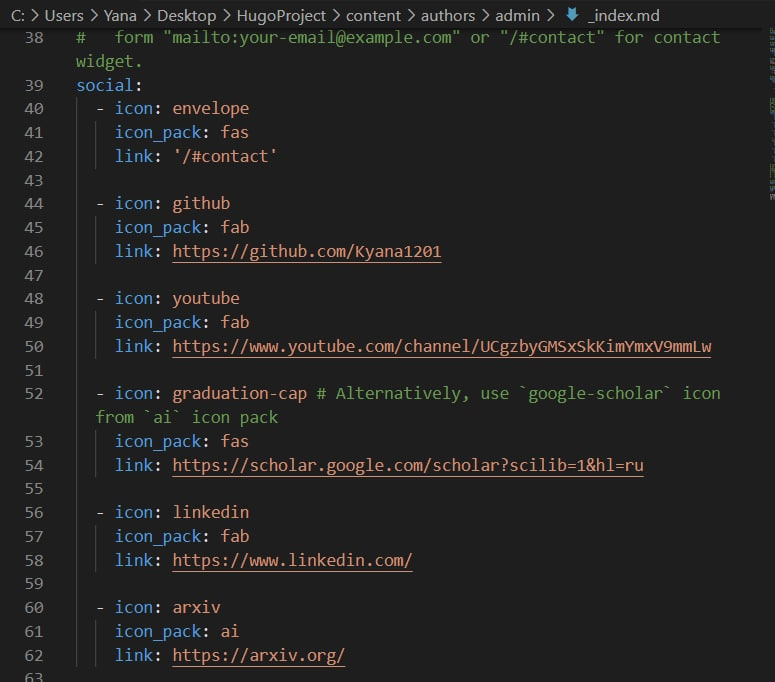
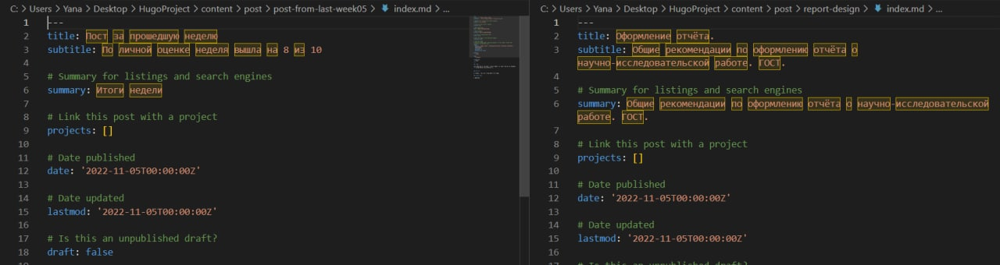
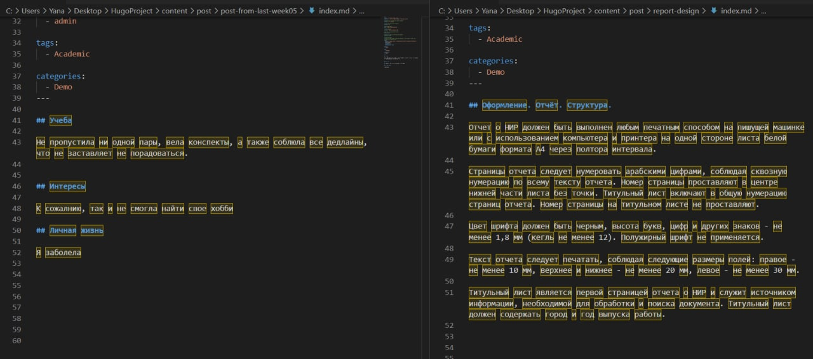
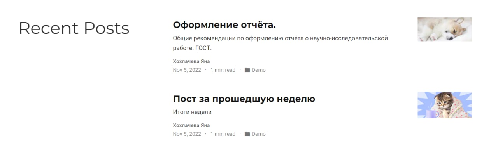

---
## Front matter
title: "Отчет по выполнению 4 этапа индивидуального проекта"

author: "Хохлачева Яна Дмитриевна, НПМмд-02-22"

## Generic otions
lang: ru-RU
toc-title: "Содержание"

## Bibliography
bibliography: bib/cite.bib
csl: pandoc/csl/gost-r-7-0-5-2008-numeric.csl

## Pdf output format
toc: true # Table of contents
toc-depth: 2
lof: true # List of figures
lot: true # List of tables
fontsize: 12pt
linestretch: 1.5
papersize: a4
documentclass: scrreprt
## I18n polyglossia
polyglossia-lang:
  name: russian
  options:
	- spelling=modern
	- babelshorthands=true
polyglossia-otherlangs:
  name: english
## I18n babel
babel-lang: russian
babel-otherlangs: english
## Fonts
mainfont: PT Serif
romanfont: PT Serif
sansfont: PT Sans
monofont: PT Mono
mainfontoptions: Ligatures=TeX
romanfontoptions: Ligatures=TeX
sansfontoptions: Ligatures=TeX,Scale=MatchLowercase
monofontoptions: Scale=MatchLowercase,Scale=0.9
## Biblatex
biblatex: true
biblio-style: "gost-numeric"
biblatexoptions:
  - parentracker=true
  - backend=biber
  - hyperref=auto
  - language=auto
  - autolang=other*
  - citestyle=gost-numeric
## Pandoc-crossref LaTeX customization
figureTitle: "Рис."
tableTitle: "Таблица"
listingTitle: "Листинг"
lofTitle: "Список иллюстраций"
lotTitle: "Список таблиц"
lolTitle: "Листинги"
## Misc options
indent: true
header-includes:
  - \usepackage{indentfirst}
  - \usepackage{float} # keep figures where there are in the text
  - \floatplacement{figure}{H} # keep figures where there are in the text
---

# Цель работы

Добавить к сайту ссылки на научные и библиометрические ресурсы.

# Задание

## Добавить к сайту ссылки на научные и библиометрические ресурсы

* eLibrary : https://elibrary.ru/;
* Google Scholar : https://scholar.google.com/;
* ORCID : https://orcid.org/;
* Mendeley : https://www.mendeley.com/;
* ResearchGate : https://www.researchgate.net/;
* Academia.edu : https://www.academia.edu/;
* arXiv : https://arxiv.org/;
* github : https://github.com/.

## Добавить пост:
* Оформление отчёта
* Языки разметки. LaTeX

# Выполнение индивидуального проекта

## Добавление ссылок на научные и библиометрические ресурсы(social)

В папке "C:/Users/Yana/Desktop/HugoProject/content/author/sadmin/" контактные ссылки (рис. [-@fig:001]).

{ #fig:001 width=70% }

## Добавление постов на тему "Оформление отчёта" и "Пост за прошедшую неделю"

 - В папке "HugoProject/content/post" создала дополнительные папки с контентом report-design и post-from-last-week05. В файле index изменила информаицю: заголовок, дата публикаации, а также основной текст.(рис. [-@fig:002], [-@fig:003], [-@fig:04])

{ #fig:002 width=70% }

{ #fig:003 width=70% }

{ #fig:04 width=70% }

# Выводы

Таким образом в процессе четвертого этапа индивидуального проекта я добавила основную информацию о себе, а также добавила пост на сайт.

# Список литературы{.unnumbered}

::: {#refs}
:::
