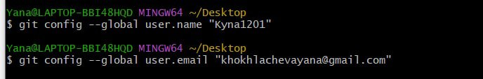
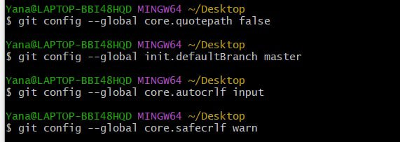
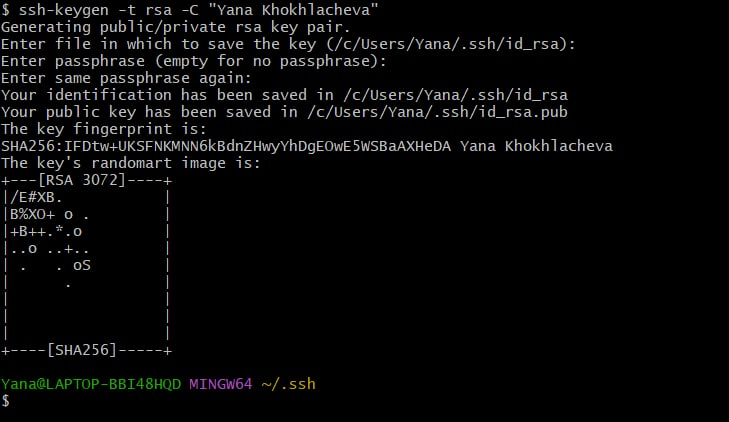
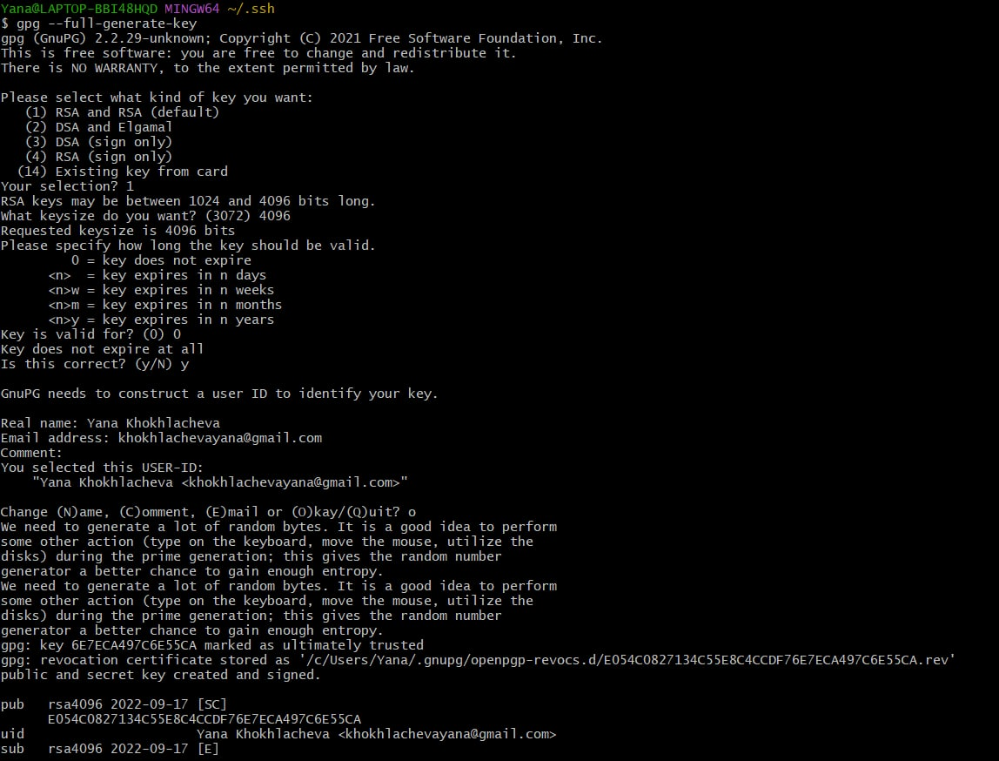
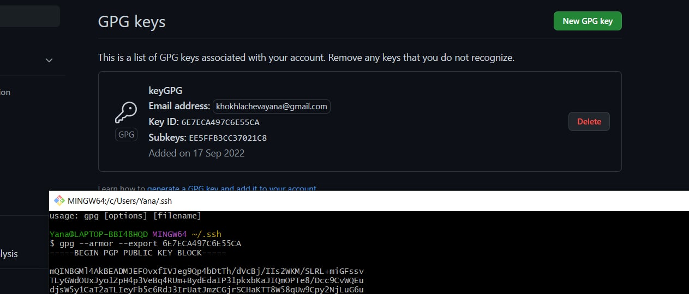
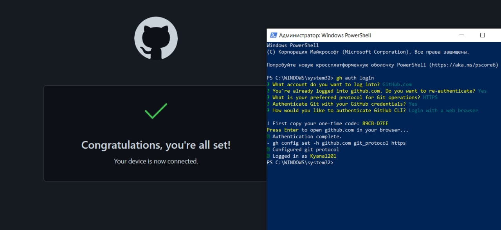
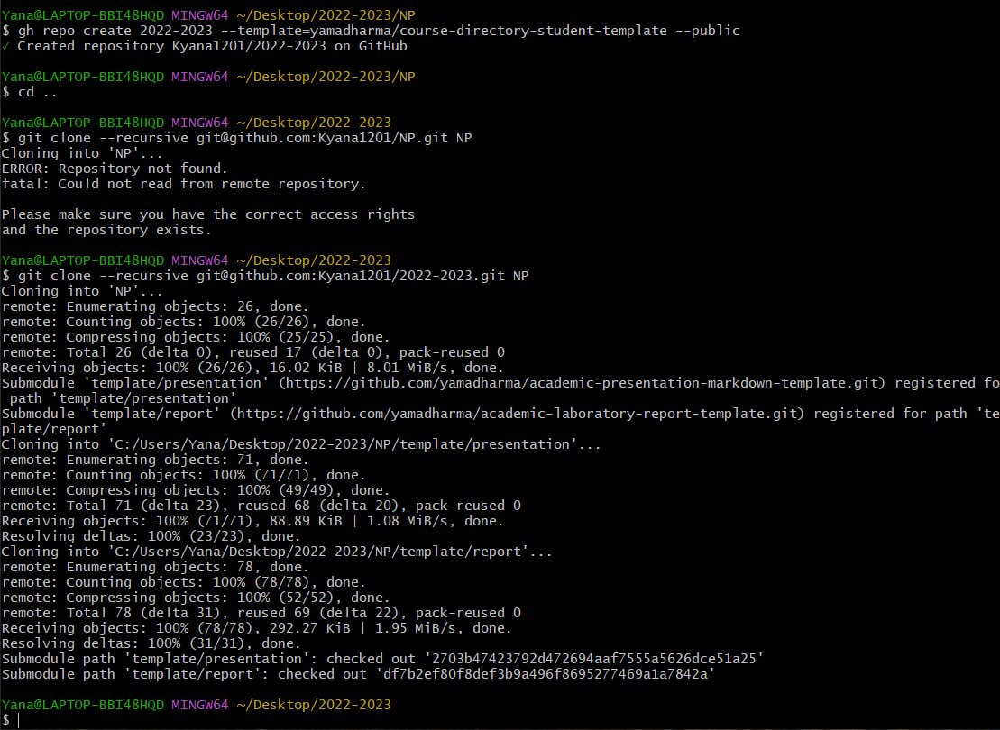
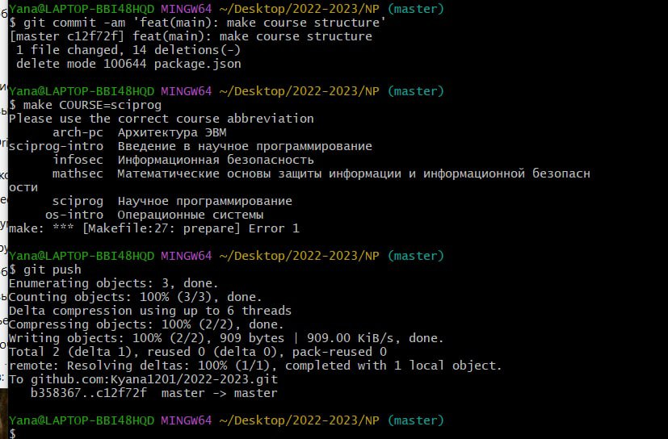

---
## Front matter
lang: ru-RU
title: Лабораторная работа №1
subtitle: Система контроля версий
author:
  - Хохлачева Яна Дмитриевна, НПМмд-02-22
institute:
  - Российский университет дружбы народов, Москва, Россия
date: 17 сентября 2022

## i18n babel
babel-lang: russian
babel-otherlangs: english

## Formatting pdf
toc: false
toc-title: Содержание
slide_level: 2
aspectratio: 169
section-titles: true
theme: metropolis
header-includes:
 - \metroset{progressbar=frametitle,sectionpage=progressbar,numbering=fraction}
 - '\makeatletter'
 - '\beamer@ignorenonframefalse'
 - '\makeatother'
---

# Цели и задачи

## Цель лабораторной работы

 - Изучить идеологию и применение средств контроля версий.
 - Освоить умения по работе с git.

## Задачи лабораторной работы 

 - Создать базовую конфигурацию для работы с git.
 - Создать ключ SSH.
 - Создать ключ PGP.
 - Настроить подписи git.
 - Зарегистрироваться на Github.
 - Создать локальный каталог для выполнения заданий по предмету

# Выполнение лабораторной работы

## Базовая настройка git

{ #fig:001 width=70% }

{ #fig:002 width=70% }

## Создайте ключи ssh

{ #fig:003 width=70% }

## Создайте ключи pgp

{ #fig:004 width=60% }

## Добавление PGP ключа в GitHub

{ #fig:005 width=70% }

## Настройка автоматических подписей коммитов git

{ #fig:006 width=70% }

{ #fig:007 width=70% }

## Настройка gh

{ #fig:008 width=70% }

## Сознание репозитория курса на основе шаблона

{ #fig:009 width=70% }

{ #fig:010 width=70% }

# Выводы

## Результаты выполнения лабораторной работы

Таким образом в процессе лабораторной работы я изучила систему контроля версий git, ее идеологию и принципы.

