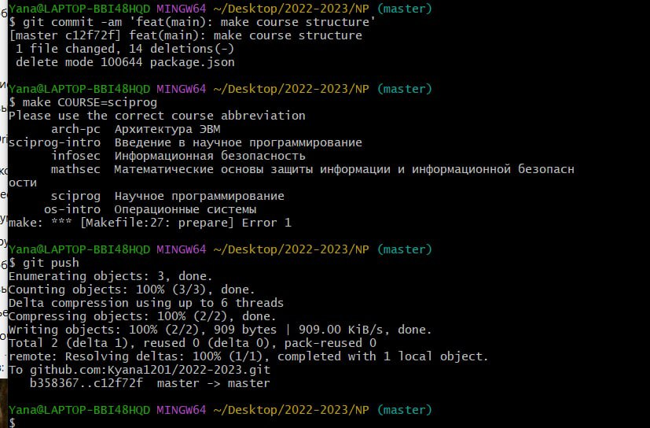

---
## Front matter
title: "Лабораторная работа №1"
subtitle: "Управление версиями"
author: "Хохлачева Яна Дмитриевна, НПМмд-02-22"

## Generic otions
lang: ru-RU
toc-title: "Содержание"

## Bibliography
bibliography: bib/cite.bib
csl: pandoc/csl/gost-r-7-0-5-2008-numeric.csl

## Pdf output format
toc: true # Table of contents
toc-depth: 2
lof: true # List of figures
lot: true # List of tables
fontsize: 12pt
linestretch: 1.5
papersize: a4
documentclass: scrreprt
## I18n polyglossia
polyglossia-lang:
  name: russian
  options:
	- spelling=modern
	- babelshorthands=true
polyglossia-otherlangs:
  name: english
## I18n babel
babel-lang: russian
babel-otherlangs: english
## Fonts
mainfont: PT Serif
romanfont: PT Serif
sansfont: PT Sans
monofont: PT Mono
mainfontoptions: Ligatures=TeX
romanfontoptions: Ligatures=TeX
sansfontoptions: Ligatures=TeX,Scale=MatchLowercase
monofontoptions: Scale=MatchLowercase,Scale=0.9
## Biblatex
biblatex: true
biblio-style: "gost-numeric"
biblatexoptions:
  - parentracker=true
  - backend=biber
  - hyperref=auto
  - language=auto
  - autolang=other*
  - citestyle=gost-numeric
## Pandoc-crossref LaTeX customization
figureTitle: "Рис."
tableTitle: "Таблица"
listingTitle: "Листинг"
lofTitle: "Список иллюстраций"
lotTitle: "Список таблиц"
lolTitle: "Листинги"
## Misc options
indent: true
header-includes:
  - \usepackage{indentfirst}
  - \usepackage{float} # keep figures where there are in the text
  - \floatplacement{figure}{H} # keep figures where there are in the text
---

# Цель работы

 - Изучить идеологию и применение средств контроля версий.
 - Освоить умения по работе с git.

# Задание

 - Создать базовую конфигурацию для работы с git.
 - Создать ключ SSH.
 - Создать ключ PGP.
 - Настроить подписи git.
 - Зарегистрироваться на Github.
 - Создать локальный каталог для выполнения заданий по предмету

# Выполнение лабораторной работы

## Настройка github

Произвела первоначальную настройку github:

1. Создала учётную запись на https://github.com.
2. Заполнила основные данные на https://github.com.

## Базовая настройка git

 - Задала имя и email владельца репозитория:

{ #fig:001 width=70% }

 - Настроила utf-8 в выводе сообщений git:
 - Настроила верификацию и подписание коммитов git, задала имя начальной ветки (будем называть её master), параметр autocrlf, параметр safecrlf:

{ #fig:002 width=70% }

## Создайте ключи ssh

 - по алгоритму rsa с ключём размером 4096 бит:

{ #fig:003 width=70% }

 - по алгоритму ed25519:

## Создайте ключи pgp

{ #fig:004 width=70% }

## Добавление PGP ключа в GitHub

{ #fig:005 width=70% }

## Настройка автоматических подписей коммитов git

 - Используя введёный email, указала Git применять его при подписи коммитов:

{ #fig:006 width=70% }

{ #fig:007 width=70% }

## Настройка gh

 - Процесс авторизации

{ #fig:008 width=70% }

## Сознание репозитория курса на основе шаблона

{ #fig:009 width=70% }

{ #fig:010 width=70% }

# Выводы

Таким образом в процессе лабораторной работы я изучила систему контроля версий git, ее идеологию и принципы.

# Ответы на контрольные вопросы

1. Система контроля версий предназначена для ведения истории изменений. Каждое изменение добавляется через коммиты, и составляется дерево коммитов. В любой момент времени можно вернуться на любую ноду дерева  

2. Хранилище - удаленный сервер, на котором хранится проект с гит файлами, commit - изменение в проект, которое затем должно быть подтверждено командой git push. История - дерево всех коммитов. Рабочая копия - создается с помощью git clone, копия на локальной машине, в которую вносятся изменения. Они могут быть загружены на сервер через коммиты.  

3. Централизованные системы используют единственный сервер, содержащий все версии файлов, и некоторое количество клиентов, которые получают файлы из этого централизованного хранилища. Примеры: CVS, Subversion и Perforce.  

4. При единоличной работе с хранилищем применяются такие же правила как и при работе с общим хранилищем.

5. При работе с общим хранилищем необходимо для каждой функции строго добавлять новую ветку feature, реализовывать её и слиять с веткой develop.  

6. Защищает исходный код от потери, обеспечивает командную работу, помогает отменить изменения, распределённая работа.  

7. git add, git commit, git push, git remote, git clone, git flow, git branch, git merge, git checkout, git pull, git init, git config  

8. Если нужно вести систему контроля, но в целом мы не делимся кодом с командой, и нам не нужно иметь доступ к коду с разных устройств, которые практически никак не связаны с нашей локальной сетью, то можно использовать локальные репозитории. В противном случае нужно использовать удаленные репозитории. 

9. Ветви - отдельные истории в СКВ, которые позволяют вести разработки параллельно. Над двумя ветками могут работать две разные комманды, а затем их можно слить в одну.

10. Через файл .gitignore. Потому что некоторые файлы могут быть слишком большими или отвечающими за определение конкретной локальной среды разработки.

# Список литературы{.unnumbered}

::: {#refs}
:::
