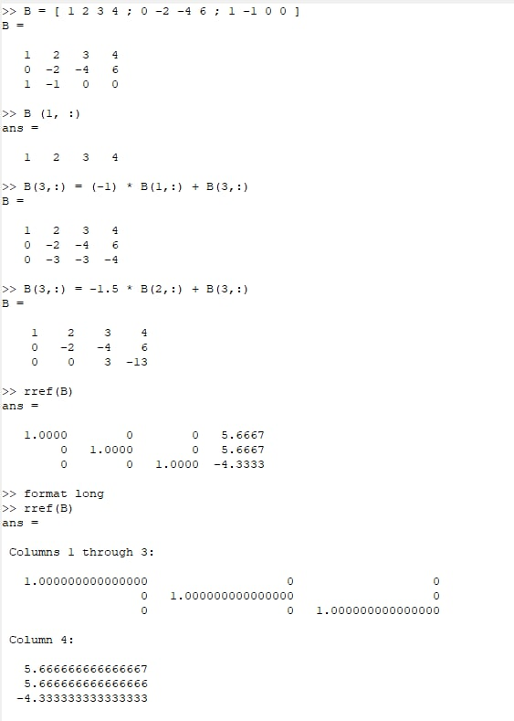

---
## Front matter
lang: ru-RU
title: Лабораторная работа №4
subtitle: Системы линейных уравнений
author:
  - Хохлачева Яна Дмитриевна, НПМмд-02-22
institute:
  - Российский университет дружбы народов, Москва, Россия
date: 29 октября 2022

## i18n babel
babel-lang: russian
babel-otherlangs: english

## Formatting pdf
toc: false
toc-title: Содержание
slide_level: 2
aspectratio: 169
section-titles: true
theme: metropolis
header-includes:
 - \metroset{progressbar=frametitle,sectionpage=progressbar,numbering=fraction}
 - '\makeatletter'
 - '\beamer@ignorenonframefalse'
 - '\makeatother'
---

# Цели и задачи

## Цель лабораторной работы

Научиться решать системы линейных уравнений с помощью Octave.

## Задачи лабораторной работы 

Решить систему уравнений методом Гаусса, с использованием левого деления и с помощью LU-разложения и LUP-разложения.

# Выполнение лабораторной работы

## Шаг 1

{ #fig:001 width=70% }

## Шаг 2

{ #fig:005 width=70% }

## Шаг 3

{ #fig:002 width=70% }

## Шаг 3

{ #fig:003 width=70% }

## Шаг 4

{ #fig:004 width=70% }

# Выводы

Ознакомилась с решением систем линейных уравнений в Octave, а именно использованием метода Гаусса, левого деления, LU-разложения и LUP-разложения.

