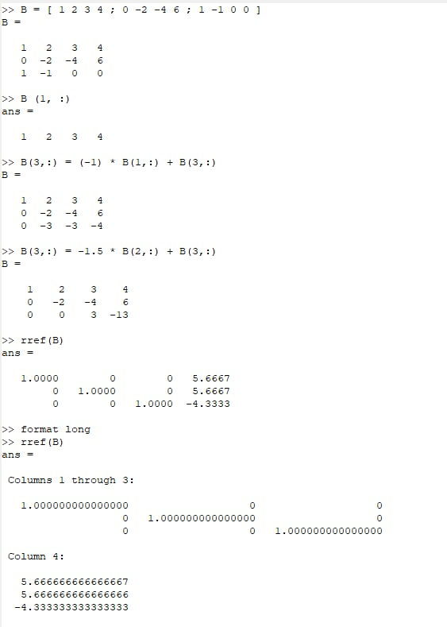
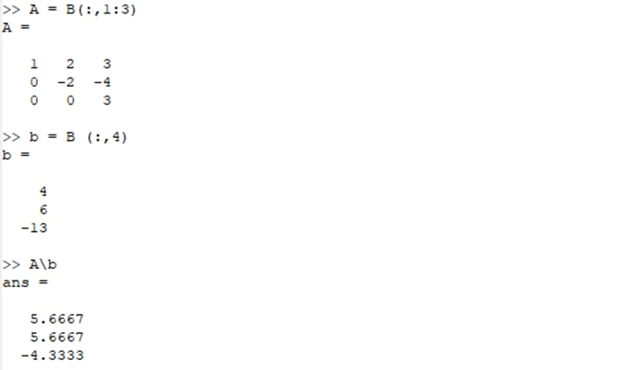
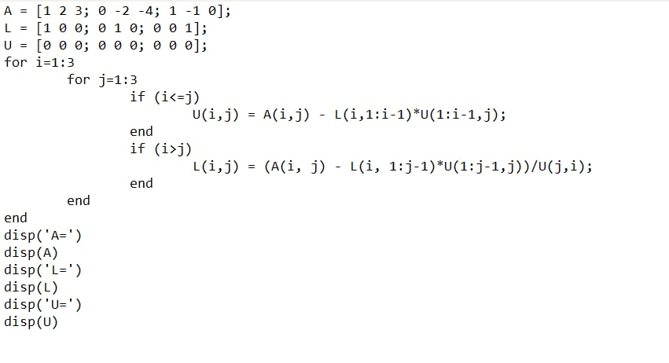
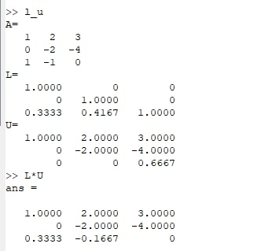
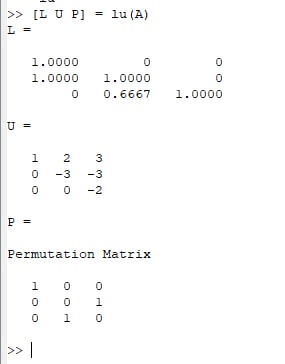

---
## Front matter
title: "Лабораторная работа №4"
subtitle: "Системы линейных уравнений"
author: "Хохлачева Яна Дмитриевна, НПМмд-02-22"

## Generic otions
lang: ru-RU
toc-title: "Содержание"

## Bibliography
bibliography: bib/cite.bib
csl: pandoc/csl/gost-r-7-0-5-2008-numeric.csl

## Pdf output format
toc: true # Table of contents
toc-depth: 2
lof: true # List of figures
lot: true # List of tables
fontsize: 12pt
linestretch: 1.5
papersize: a4
documentclass: scrreprt
## I18n polyglossia
polyglossia-lang:
  name: russian
  options:
	- spelling=modern
	- babelshorthands=true
polyglossia-otherlangs:
  name: english
## I18n babel
babel-lang: russian
babel-otherlangs: english
## Fonts
mainfont: PT Serif
romanfont: PT Serif
sansfont: PT Sans
monofont: PT Mono
mainfontoptions: Ligatures=TeX
romanfontoptions: Ligatures=TeX
sansfontoptions: Ligatures=TeX,Scale=MatchLowercase
monofontoptions: Scale=MatchLowercase,Scale=0.9
## Biblatex
biblatex: true
biblio-style: "gost-numeric"
biblatexoptions:
  - parentracker=true
  - backend=biber
  - hyperref=auto
  - language=auto
  - autolang=other*
  - citestyle=gost-numeric
## Pandoc-crossref LaTeX customization
figureTitle: "Рис."
tableTitle: "Таблица"
listingTitle: "Листинг"
lofTitle: "Список иллюстраций"
lotTitle: "Список таблиц"
lolTitle: "Листинги"
## Misc options
indent: true
header-includes:
  - \usepackage{indentfirst}
  - \usepackage{float} # keep figures where there are in the text
  - \floatplacement{figure}{H} # keep figures where there are in the text
---

# Цель работы

Научиться решать системы линейных уравнений с помощью Octave.

# Задание

Решить систему уравнений методом Гаусса, с использованием левого деления и с помощью LU-разложения и LUP-разложения.

# Выполнение лабораторной работы

## Шаг 1

Построила расширенную матрицу системы линейных уравнений. Сначала добавила к третьей строке первую строку, умноженную на −1. Далее добавила к третьей строке вторую строку, умноженную на −1.5. Из полученной треугольной матрицы, представленной на Рисунке 1 (рис - fig. 1), как и выполненные для ее получения команды, можно получить решение. Для непосредственного поиска треугольной формы матрицы использовала встроенную функцию. Из результата ее выполнения, представленного на Рисунке 1 (рис - fig. 1), решение системы очевидно.

{ #fig:001 width=70% }

## Шаг 2

 Для решения системы вида Ax=b использовала встроенную операцию левого деления, что продемонстрированно на рисунке 2 (рис - fig. 2).

{ #fig:005 width=70% }

## Шаг 3

С помощью Octave расписала LU-разложение данной матрицы в файле l_u.m, содержание которого показано на Рисунке 2 (рис - fig. 2). Запуск файла и результат выполнения показан на Рисунке 3 (рис - fig. 3).

{ #fig:002 width=70% }

{ #fig:003 width=70% }

## Шаг 4

На Рисунке 4 (рис - fig. 4) показано вычисление LUP-разложения матрицы с помощью встроенной функции.

{ #fig:004 width=70% }

# Выводы

Ознакомилась с решением систем линейных уравнений в Octave, а именно использованием метода Гаусса, левого деления, LU-разложения и LUP-разложения.

# Список литературы{.unnumbered}

::: {#refs}
:::
