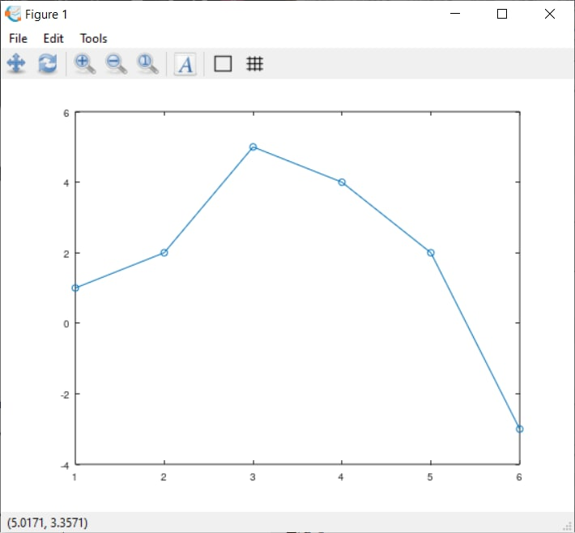
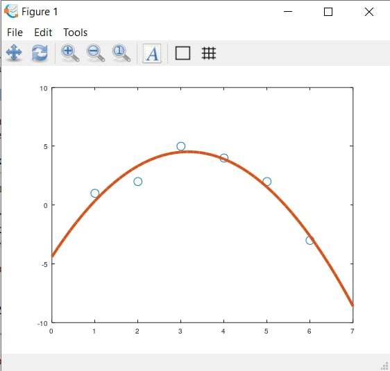
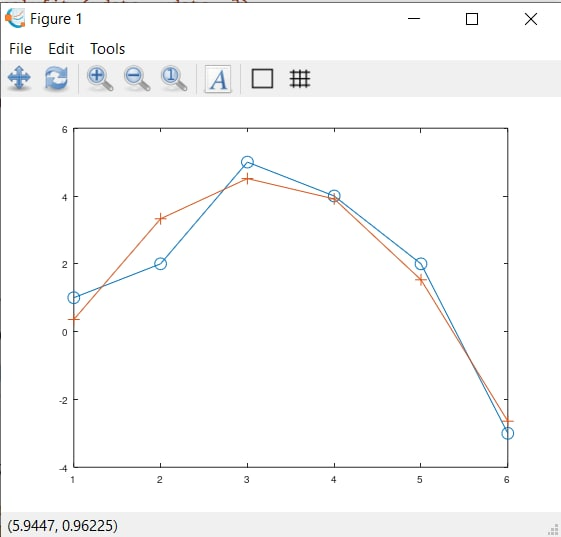
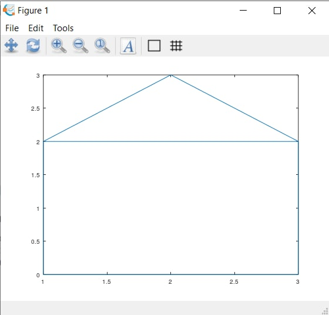
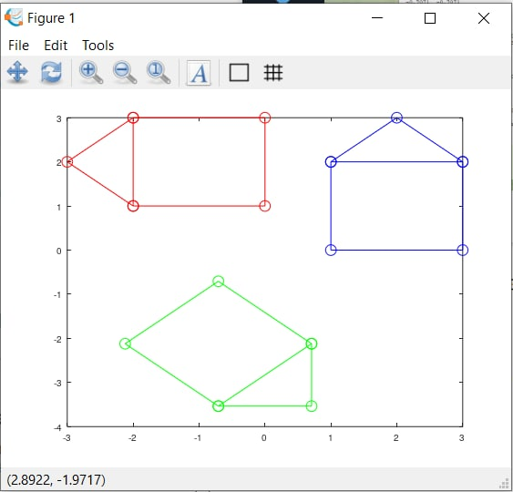
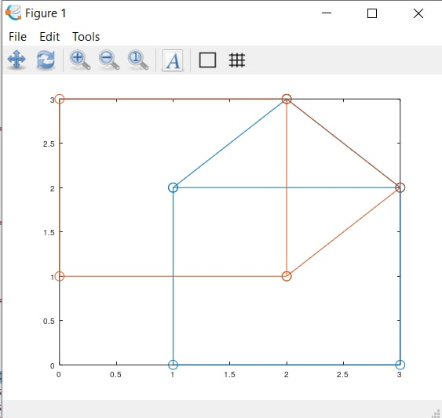
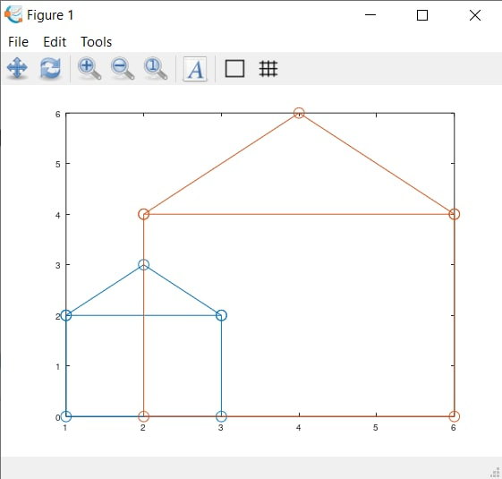

---
## Front matter
lang: ru-RU
title: Лабораторная работа №5
subtitle: Научное программирование
author:
  - Хохлачева Яна Дмитриевна, НПМмд-02-22
institute:
  - Российский университет дружбы народов, Москва, Россия
date: 12 ноября 2022

## i18n babel
babel-lang: russian
babel-otherlangs: english

## Formatting pdf
toc: false
toc-title: Содержание
slide_level: 2
aspectratio: 169
section-titles: true
theme: metropolis
header-includes:
 - \metroset{progressbar=frametitle,sectionpage=progressbar,numbering=fraction}
 - '\makeatletter'
 - '\beamer@ignorenonframefalse'
 - '\makeatother'
---

# Цели и задачи

## Цель лабораторной работы

Научиться решать общую проблему подгонки полинома к множеству точек с помощью Octave

## Задачи лабораторной работы 

Рассмотреть методы матричного преобразования, вращения, отражения, а также дилатации

# Выполнение лабораторной работы

## Подгонка полиномиальной кривой

{ #fig:002 width=70% }

## Подгонка полиномиальной кривой

{ #fig:005 width=70% }

## Подгонка полиномиальной кривой

{ #fig:007 width=70% }

## Матричные преобразования

{ #fig:009 width=70% }

## Вращение

{ #fig:011 width=70% }

## Отражение

{ #fig:013 width=70% }

## Дилатация

{ #fig:015 width=70% }

# Выводы

Ознакомилась с решением общей проблемы подгонки полинома к множеству точек с помощью Octave. Рассмотрены методы матричного преобразования, вращения, отражения, а также дилатации.
