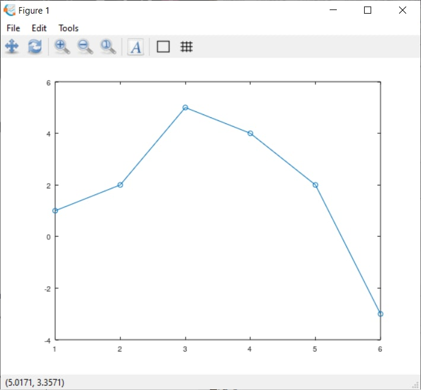

---
## Front matter
title: "Лабораторная работа №5"
subtitle: "Научное программирование"
author: "Хохлачева Яна Дмитриевна, НПМмд-02-22"

## Generic otions
lang: ru-RU
toc-title: "Содержание"

## Bibliography
bibliography: bib/cite.bib
csl: pandoc/csl/gost-r-7-0-5-2008-numeric.csl

## Pdf output format
toc: true # Table of contents
toc-depth: 2
lof: true # List of figures
lot: true # List of tables
fontsize: 12pt
linestretch: 1.5
papersize: a4
documentclass: scrreprt
## I18n polyglossia
polyglossia-lang:
  name: russian
  options:
	- spelling=modern
	- babelshorthands=true
polyglossia-otherlangs:
  name: english
## I18n babel
babel-lang: russian
babel-otherlangs: english
## Fonts
mainfont: PT Serif
romanfont: PT Serif
sansfont: PT Sans
monofont: PT Mono
mainfontoptions: Ligatures=TeX
romanfontoptions: Ligatures=TeX
sansfontoptions: Ligatures=TeX,Scale=MatchLowercase
monofontoptions: Scale=MatchLowercase,Scale=0.9
## Biblatex
biblatex: true
biblio-style: "gost-numeric"
biblatexoptions:
  - parentracker=true
  - backend=biber
  - hyperref=auto
  - language=auto
  - autolang=other*
  - citestyle=gost-numeric
## Pandoc-crossref LaTeX customization
figureTitle: "Рис."
tableTitle: "Таблица"
listingTitle: "Листинг"
lofTitle: "Список иллюстраций"
lotTitle: "Список таблиц"
lolTitle: "Листинги"
## Misc options
indent: true
header-includes:
  - \usepackage{indentfirst}
  - \usepackage{float} # keep figures where there are in the text
  - \floatplacement{figure}{H} # keep figures where there are in the text
---

# Цель работы

Научиться решать общую проблему подгонки полинома к множеству точек с помощью Octave.

# Задание

Рассмотреть методы матричного преобразования, вращения, отражения, а также дилатации.

# Выполнение лабораторной работы

## Подгонка полиномиальной кривой

В статистике часто рассматривается проблема подгонки прямой линии к набору данных. Решим более общую проблему подгонки полинома к множеству точек. Пусть нам нужно найти параболу по методу наименьших квадратов для набора точек, заданных матрицей. В матрице заданы значения x в столбце 1 и значения y в столбце 2. Введём матрицу данных в Octave и извлечём вектора x и y.

{ #fig:001 width=70% }

{ #fig:002 width=70% }

Построим уравнение вида y = ax2 + bx + c. Подставляя данные, получаем следующую систему линейных уравнений. Обратим внимание на форму матрицы коэффициентов A. Третий столбец – все единицы, второй столбец – значения x, а первый столбец – квадрат значений x. Правый вектор – это значения y. Есть несколько способов построить матрицу коэффициентов в Octave. Один из подходов состоит в том, чтобы использовать команду ones для создания матрицы единиц соответствующего размера, а затем перезаписать первый и второй столбцы необходимыми данными.

{ #fig:003 width=70% }

Решение по методу наименьших квадратов получается из решения уравнения ATAb = ATy, где b – вектор коэффициентов полинома. Используем Octave для построения уравнений.

{ #fig:004 width=70% }

{ #fig:005 width=70% }

Процесс подгонки может быть автоматизирован встроенными функциями Octave.  Для этого мы можем использовать встроенную функцию для подгонки полинома polyfit. Значения полинома P в точках, задаваемых вектором-строкой x можно получить с помощью функции polyval. Получим подгоночный полином

{ #fig:006 width=70% }

{ #fig:007 width=70% }

## Матричные преобразования

Матрицы и матричные преобразования играют ключевую роль в компьютерной графике. Существует несколько способов представления изображения в виде матрицы. Подход, который мы здесь используем, состоит в том, чтобы перечислить ряд вершин, которые соединены последовательно, чтобы получить ребра простого графа. Мы записываем это как матрицу 2 × n, где каждый столбец представляет точку на рисунке. В качестве простого примера, давайте попробуем закодировать граф-домик. Есть много способов закодировать это как матрицу. Эффективный метод состоит в том, чтобы выбрать путь, который проходит по каждому ребру ровно один раз (цикл Эйлера).

{ #fig:008 width=70% }

{ #fig:009 width=70% }

## Вращение

Рассмотрим различные способы преобразования изображения. Вращения
могут быть получены с использованием умножения на специальную матрицу. 
Чтобы произвести повороты матрицы данных D, нам нужно вычислить произведение матриц RD. Повернём граф дома на 90 и 225. Вначале переведём угол в радианы.

{ #fig:010 width=70% }

{ #fig:011 width=70% }

## Отражение

Отразим граф дома относительно прямой y = x. Зададим матрицу отражения.

{ #fig:012 width=70% }

{ #fig:013 width=70% }

## Дилатация

Дилатация (то есть расширение или сжатие) также может быть выполнено путём умножения матриц. Тогда матричное произведение T D будет преобразованием дилатации D с коэффициентом k. Увеличим граф дома в 2 раза

{ #fig:014 width=70% }

{ #fig:015 width=70% }

# Выводы

Ознакомилась с решением общей проблемы подгонки полинома к множеству точек с помощью Octave. Рассмотрены методы матричного преобразования, вращения, отражения, а также дилатации.

# Список литературы{.unnumbered}

::: {#refs}
:::
