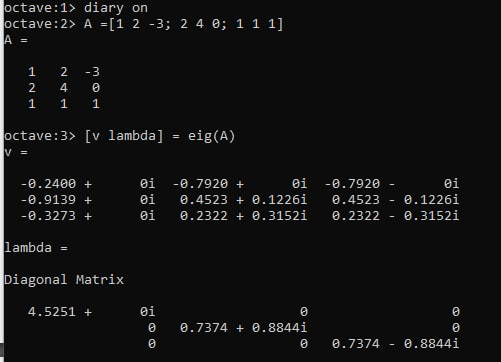
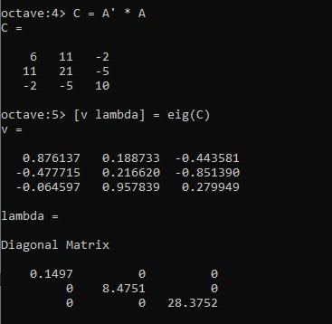
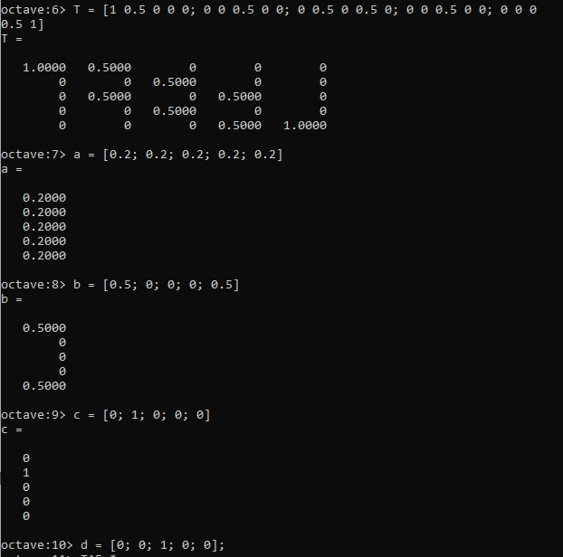
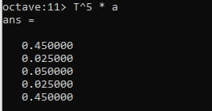
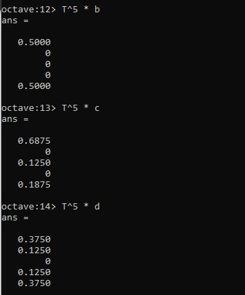
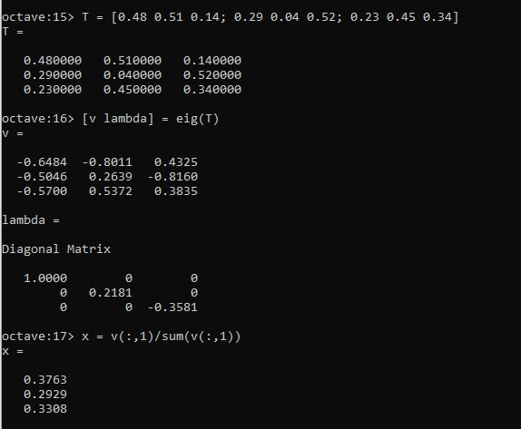
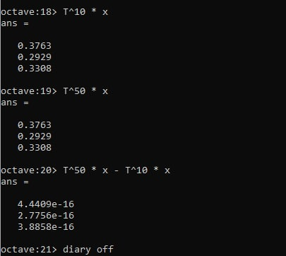

---
## Front matter
lang: ru-RU
title: Лабораторная работа №8
subtitle: Научное программирование
author:
  - Хохлачева Яна Дмитриевна, НПМмд-02-22
institute:
  - Российский университет дружбы народов, Москва, Россия
date: 17 декабря 2022

## i18n babel
babel-lang: russian
babel-otherlangs: english

## Formatting pdf
toc: false
toc-title: Содержание
slide_level: 2
aspectratio: 169
section-titles: true
theme: metropolis
header-includes:
 - \metroset{progressbar=frametitle,sectionpage=progressbar,numbering=fraction}
 - '\makeatletter'
 - '\beamer@ignorenonframefalse'
 - '\makeatother'
---

# Цели и задачи

## Цель лабораторной работы

Научиться вычислять собственные значения и собственные векторы, предсказывать, в каком состоянии в цепи Маркова окажемся через определенное количество ходов, находить вектор равновесного состояния для цепи Маркова с помощью Octave.

## Задачи лабораторной работы 

Найти собственные значения и собственные векторы матрицы

{ #fig:001 width=70% }

## Задачи лабораторной работы 

{ #fig:002 width=70% }

## Задачи лабораторной работы 

Найти вероятности цепи Маркова после 5 шагов для четырех начальных векторов вероятностей

{ #fig:003 width=70% }

## Задачи лабораторной работы 

{ #fig:004 width=70% }

## Задачи лабораторной работы 

{ #fig:005 width=70% }

## Задачи лабораторной работы 

Найти равновесное состояния для цепи Маркова

{ #fig:006 width=70% }

## Задачи лабораторной работы 

{ #fig:007 width=70% }

# Выводы

Результатом выполнения работы стали вычисленные собственные значения и вектора, равновесное состояние цепи Маркова, предсказанные вероятности цепи Маркова через 5 шагов в Octave, что отражает проделанную мной работу и полученные новые знания.
