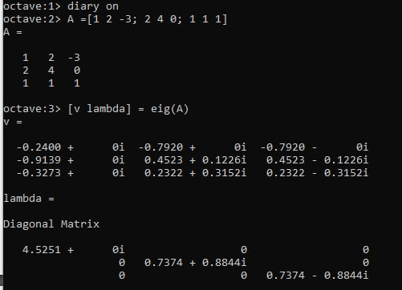
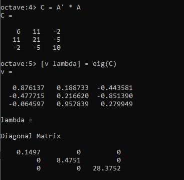
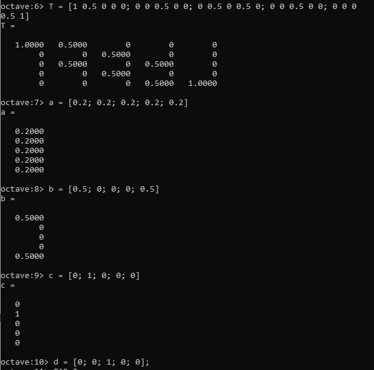
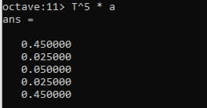
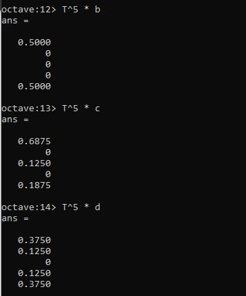
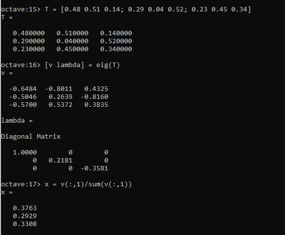
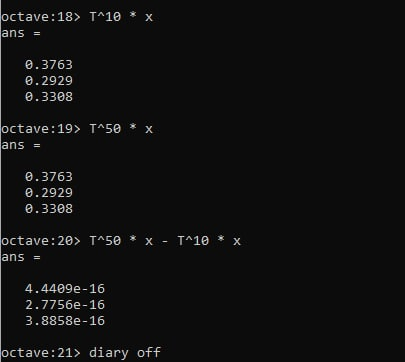

---
## Front matter
title: "Лабораторная работа №8"
subtitle: "Научное программирование"
author: "Хохлачева Яна Дмитриевна, НПМмд-02-22"

## Generic otions
lang: ru-RU
toc-title: "Содержание"

## Bibliography
bibliography: bib/cite.bib
csl: pandoc/csl/gost-r-7-0-5-2008-numeric.csl

## Pdf output format
toc: true # Table of contents
toc-depth: 2
lof: true # List of figures
lot: true # List of tables
fontsize: 12pt
linestretch: 1.5
papersize: a4
documentclass: scrreprt
## I18n polyglossia
polyglossia-lang:
  name: russian
  options:
	- spelling=modern
	- babelshorthands=true
polyglossia-otherlangs:
  name: english
## I18n babel
babel-lang: russian
babel-otherlangs: english
## Fonts
mainfont: PT Serif
romanfont: PT Serif
sansfont: PT Sans
monofont: PT Mono
mainfontoptions: Ligatures=TeX
romanfontoptions: Ligatures=TeX
sansfontoptions: Ligatures=TeX,Scale=MatchLowercase
monofontoptions: Scale=MatchLowercase,Scale=0.9
## Biblatex
biblatex: true
biblio-style: "gost-numeric"
biblatexoptions:
  - parentracker=true
  - backend=biber
  - hyperref=auto
  - language=auto
  - autolang=other*
  - citestyle=gost-numeric
## Pandoc-crossref LaTeX customization
figureTitle: "Рис."
tableTitle: "Таблица"
listingTitle: "Листинг"
lofTitle: "Список иллюстраций"
lotTitle: "Список таблиц"
lolTitle: "Листинги"
## Misc options
indent: true
header-includes:
  - \usepackage{indentfirst}
  - \usepackage{float} # keep figures where there are in the text
  - \floatplacement{figure}{H} # keep figures where there are in the text
---

# Цель работы

Научиться вычислять собственные значения и собственные векторы, предсказывать, в каком состоянии в цепи Маркова окажемся через определенное количество ходов, находить вектор равновесного состояния для цепи Маркова с помощью Octave.

# Задание

Найти собственные значения и собственные векторы матрицы: предсказать, в каком состоянии в цепи Маркова окажемся через определенное количество ходов; найти вектор равновесного состояния для цепи Маркова.

# Выполнение лабораторной работы

## Шаг 1

Задала матрицу А и нашла ее собственные векторы и собственные значения с помощью команды eig с двумя выходными аргументами. Для получения матрицы с действительными собственными значениями, умножила входную матрицу на транспонированную матрицу. Соответствующие команды и результаты показаны на Рисунке 1 и Рисунке 2

{ #fig:001 width=70% }

{ #fig:002 width=70% }

## Шаг 2

Рассмотрим марковскую цепь, для которой дана матрицы переходов T и четыре различных начальных векторов вероятности. Для нахождения вероятностей после 5 шагов возвела матрицу Т в пятую степень и умножила на начальный вектор вероятностей. Соответствующие команды и результаты показаны на Рисунке 3, 4, 5 

{ #fig:003 width=70% }

{ #fig:004 width=70% }

{ #fig:005 width=70% }

## Шаг 3

Для нахождения равновесного состояния для цепи Маркова задала новую переходную матрицу и нашла его собственный вектор x для собственного значения равного 1,компоненты которого неотрицательны и в сумме дают 1. Данный вектор и является равновесным состоянием состоянием цепи. Нахождение данного вектора и проверка того, что это действительно равновесное состояние, показана на Рисунке 6 и 7

{ #fig:006 width=70% }

{ #fig:007 width=70% }

# Выводы

Я научилась вычислять собственные значения и собственные векторы, предсказывать, в каком состоянии в цепи Маркова окажемся через определенное количество ходов, находить вектор равновесного состояния для цепи Маркова с помощью Octave. 

# Список литературы{.unnumbered}

::: {#refs}
:::
